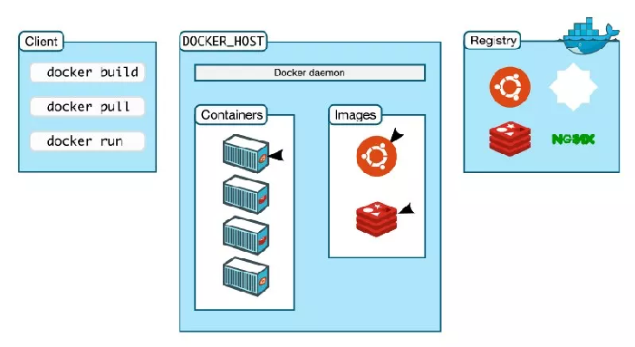
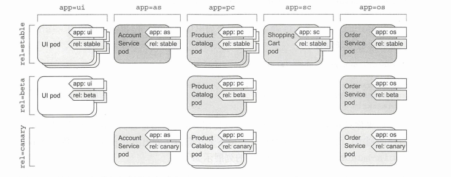
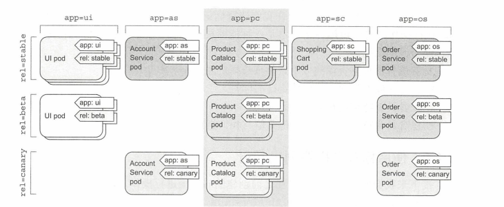

第一部分  docker初级

## 什么是容器

容器是一种轻量级的虚拟化技术，基于 namespace 和 cgroup 技术做到进程的资源隔离和限制。容器跟虚拟机比起来，少了一层 hypervisor 层。容器将应用程序与该程序的依赖，打包在容器镜像里面。运行这个镜像，就会生成一个虚拟容器。程序在这个虚拟容器里运行，就好像在真实的物理机上运行一样。有了 Docker，就不用担心环境问题。

## docker的目标


* copy-on-write，使得修改镜像方便，快捷 

* 充分利用系统资源 ：容器之间共享内核资源，不需要额外的管理程序消耗系统资源

* 职责的逻辑分离 

  开发人员只关心容器中运行的应用程序，运维人员只需管理容器。docker设计的目的是为了加强开发人员写代码的开发环境和应用程序的生产环境的一致性。 

* 快速、高效的开发生命周期 

  缩短代码从开发、测试到部署、上线运行的周期，让应用程序具备可移植性、易于构建，并易于协作。 

* 鼓励使用面向服务的架构 

  docker推荐单个容器只运行一个应用程序或者进程，从而使分布式部署应用程序，扩展或调试应用程序都变得非常简单 

## **docker架构** 



- docker客户端和引擎 


​	docker是一个客户端/服务器（cs）架构的程序，docker客户端只需向docker服务端或者守护进程发送请求，服务器或守护进程将完成所有的工作并返回结果。dokcer提供一个命令行工具docker以及一整套RESTful API来与守护进程进行交互。用户可以在同一台宿主机上运行docker客户端和docker守护进程，也可以从本地的docker客户端连接到另一台宿主机上的远程docker守护进程。 

- 镜像 

  用户基于镜像运行容器。镜像是docker生命周期中的“构建”部分。镜像是基于联合文件系统的一种分层的结构。通常由一系列指令一步一步构建出来。 

- registry 

  docker使用registry来保存用户构建的镜像。registry分为公共和私有两种。公有的为docker hub，私有的为用户搭建的私有仓库。 


- 容器 

  docker可以帮助用户构建和部署镜像，用户只需把自己的应用程序或服务打包放进容器即可。容器是docker生命周期的启动或执行阶段。 

## docker 容器实战 

- 安装docker

  ```shell
  #下载docker
  curl -sSL https://get.daocloud.io/docker | sh
  #设置国内的镜像源，默认是docker从docker hub中拉取镜像，可能存在速度慢的情况
  vim /etc/docker/daemon.json
  {
    "registry-mirrors" : [
      "http://ovfftd6p.mirror.aliyuncs.com",
      "http://registry.docker-cn.com",
      "http://docker.mirrors.ustc.edu.cn",
      "http://hub-mirror.c.163.com"
    ],
    "insecure-registries" : [
      "registry.docker-cn.com",
      "docker.mirrors.ustc.edu.cn"
    ],
    "debug" : true,
    "experimental" : true
  }
  
  #启动docker
  systemctl start docker 
  #设置docker开机自启
  systemctl enable docker 
  ```

- 确保docker已经就绪 

```shell
[root@CENTOS7-99-91 ~]# docker info
...  
 Registry Mirrors:  #该内容说明配置的国内镜像源生效
  http://ovfftd6p.mirror.aliyuncs.com/
  http://registry.docker-cn.com/
  http://docker.mirrors.ustc.edu.cn/
  http://hub-mirror.c.163.com/
...
```

-   帮助命令

```shell
[root@localhost ~]# docker  -h
Flag shorthand -h has been deprecated, please use --help

Usage:	docker [OPTIONS] COMMAND

A self-sufficient runtime for containers

Options:
      --config string      Location of client config files (default "/root/.docker")
...


[root@localhost ~]# docker run --help

Usage:	docker run [OPTIONS] IMAGE [COMMAND] [ARG...]

Run a command in a new container

Options:
      --add-host list                  Add a custom host-to-IP mapping (host:ip)
  -a, --attach list                    Attach to STDIN, STDOUT or STDERR
...


#查看docker run的帮助文档
root@localhost ~]# man docker-run
```

### 运行第一个容器 

```shell
docker run  -it  ubuntu /bin/bash 
```

​	 命令解释：-i表示保证容器中的STDIN是开启的，-t告诉docker为要创建的容器分配一个伪tty终端。这样新创建的容器才能提供一个交互式的shell。接下来，告诉docker使用的一个ubuntu的镜像。 

​    上述命令的执行流程：docker会检查本地是否存在ubuntu镜像，如果本地没有该镜像的话，会连接用户配置的 registry（默认为docker hub）。查看registry是否有该镜像。docker找到该镜像后就会下载该镜像并将其保存到本地宿主机中。随后，docker在文件系统内部用这个镜像创建一个新容器。该容器拥有自己的网络，ip地址，以及一个用来和宿主机进行通信的桥接网络接口。最后我们告诉docker在新容器运行什么命令。在本例中我们在容器中运行/bin/bash命令启动一个bash shell。当容器创建完毕后，Docker会执行容器中的/bin/bash命令，这时就可以看到容器内部的shell窗口了。 

- 使用第一个容器（在上述容器的里面执行如下的命令）

```shell
root@6cf6b4b7890f:/# hostname
6cf6b4b7890f   #hostname为容器id 

root@6cf6b4b7890f:/# cat /etc/hosts 
127.0.0.1	localhost
::1	localhost ip6-localhost ip6-loopback
fe00::0	ip6-localnet
ff00::0	ip6-mcastprefix
ff02::1	ip6-allnodes
ff02::2	ip6-allrouters
172.17.0.5	6cf6b4b7890f

root@6cf6b4b7890f:/# ps -aux 
USER       PID %CPU %MEM    VSZ   RSS TTY      STAT START   TIME COMMAND 
root         1  0.0  0.0   4220  2228 pts/0    Ss   08:55   0:00 /bin/bash 
root        13  0.0  0.0   5872  1404 pts/0    R+   08:57   0:00 ps -aux 

root@6cf6b4b7890f:/# exit
exit  #输入exit退出容器
```

- 容器命名 

```shell
[root@localhost ~]# docker run --name bob_the_container -it ubuntu /bin/bash 
CONTAINER ID        IMAGE               COMMAND                  CREATED             STATUS              PORTS               NAMES 
b49b6ed239cd        ubuntu              "/bin/bash"              6 seconds ago       Up 6 seconds                            bob_the_container 
```

通过--name为容器命名 。一个合法的容器名称只能包含以下字符：小写字母a-z、大写字母A-Z、数字0-9，下划线、圆点、横线，即[a-zA-z0-9._-] ，容器的命名必须是唯一的。 

如果已经命名的容器已经存在可以使用docker rm删除。 

```shell
docker rm `docker ps -aq`  #删除所有容器 
```

- 重启启动已经停止的容器 

```shell
[root@localhost ~]# docker start bob_the_container
bob_the_container

[root@localhost ~]# docker start 48deafb3313831c82  #通过ID启动已经停止的容器 
48deafb3313831c82

[root@localhost ~]# docker  restart 48deafb3313831c82  #重新启动容器 
48deafb3313831c82
```

- 附着到容器上 


docker容器重新启动后会沿用dokcer run命令时指定的参数里来运行。docker attach重新附着到该容器的会话上。 

```shell
[root@localhost ~]#docker  attach the_bob_container 

[root@localhost ~]#docker attach b49b6ed239cd   #通过id进行附着 
```

- 创建守护容器 

守护容器没有交互式会话，非常适合运行应用程序和服务。 docker run时添加-d参数

```shell
[root@localhost ~]# docker run --name daemon_dave -d ubuntu  /bin/bash -c "while true;do echo hello world;sleep 1; done" 
4c054880b77f05dff51ca4b4c008be43aaafc813d01410ad54cf4c2d073c3f5c
```

-d参数会让docker容器放到后台运行。 

- docker logs命令获取容器的日志。 


```shell
[root@localhost ~]# docker logs daemon_dave
hello world
hello world
...


[root@localhost ~]# docker logs -f daemon_dave   #使用-f可以监控docker的日志。类似tail -f
hello world
hello world
```

使用ctr+c可以退出日志跟踪 

- 日志驱动 


可以在docker run时指定--log-driver选项指定。默认的值为json-file。可选syslog，该选项将禁用docker logs命令，将所有的日志重定向到syslog。 

```shell
[root@localhost ~]# docker run --name daemon_dave --log-driver=syslog  -d nginx  /bin/bash -c "while true;do echo hello world;sleep 1; done" 
ba9aaf9d45f07fd34f11222be425f34f57e72ebef0200014ab9fdb0b18081171

[root@localhost ~]# docker logs daemon_dave 
Error response from daemon: configured logging driver does not support reading


[root@localhost ~]#  cat /var/log/messages  #查看syslog中的日志
...
Aug 11 17:23:09 localhost 3bab37410fab[1220]: hello world 
Aug 11 17:23:10 localhost 3bab37410fab[1220]: hello world 
```

- 查看容器中的进程 

```shell
[root@localhost ~]# docker top daemon_dave
UID                 PID                 PPID                C                   STIME               TTY                 TIME                CMD
root                20521               20504               0                   09:43               ?                   00:00:00            /bin/bash -c while true;do echo hello world;sleep 1; done
root                21178               20521               0                   09:45               ?                   00:00:00            sleep 1
```

- 在容器内部运行进程 

docker exec在容器内部启动新的进程。可以在容器运行的进程有两种类型：后台任务和交互任务。 

```shell
[root@localhost ~]# docker exec -d  daemon_dave touch demo.txt 
```

可以在容器中运行一个交互式的任务。 

```shell
[root@localhost ~]# docker exec -it daemon_dave /bin/bash 
root@ba9aaf9d45f0:/#  
```

- t退出后自动重启 

通过--restart可以让docker在容器退出时会自动重启容器。--restart标志会检查容器的退出代码，并依据此来决定是否要重启容器。默认的是不会重启。 

```shell
[root@localhost ~]# docker run --name daemon_dave -d --restart=always  nginx  /bin/bash -c "while true;do echo hello world;sleep 1; done" 
7756170ef594bfe5c8fa588902bec93369e6f6e0cb2644cd605581d4d7867cb8
```

--restart=on-failure 表示只在错误退出时才会重启。 

--restart=on-failure:5 重启的次数最多为5 

- 查看容器详情

docker inspect获得容器更多的信息 

```shell
[root@localhost ~]# docker inspect daemon_dave 
[
    {
        "Id": "7756170ef594bfe5c8fa588902bec93369e6f6e0cb2644cd605581d4d7867cb8",
        "Created": "2020-08-17T01:49:54.97857379Z",
        "Path": "/docker-entrypoint.sh",
        "Args": [
            "/bin/bash",
            "-c",
            "while true;do echo hello world;sleep 1; done"
        ],
...        
```

- 删除容器 

```shell
[root@localhost ~]# docker rm daemon_dave   #只能删除已经停止的容器，删除正在运行的容器使用-f 
Error response from daemon: You cannot remove a running container 7756170ef594bfe5c8fa588902bec93369e6f6e0cb2644cd605581d4d7867cb8. Stop the container before attempting removal or force remove

[root@localhost ~]# docker rm -f  daemon_dave
daemon_dave
```

- 杀死正在运行的容器

docker  kill <容器id或者容器名称>杀死一个运行的容器，发送SIGKILL给容器。直接杀死容器。 

```shell
[root@localhost ~]# docker kill daemon_dave
daemon_dave

[root@localhost ~]# docker kill 0e1
0e1
```

- 停止正在运行的容器


docker stop  <容器id或者容器名称> 发送SIGTERM 优雅的杀死容器。让容器做一些退出前的操作，安全的退出。

```shell
[root@localhost ~]# docker stop daemon_dave
daemon_dave
```

- 查看正在运行的容器 

docker ps  列出正在容器，docker ps  -a 列出所有的容器（正在运行的和已经退出的） 

```shell
[root@localhost ~]# docker ps | grep daemon_dave
40fafb92ec2e        nginx                                                           "/docker-entrypoint.…"   3 seconds ago       Up 2 seconds        80/tcp              daemon_dave


#使用docker kill杀死daemon_dave后
[root@localhost ~]# docker ps | grep daemon_dave
[root@localhost ~]# docker ps -a  | grep daemon_dave
40fafb92ec2e        nginx                                                           "/docker-entrypoint.…"   45 seconds ago      Exited (137) 7 seconds ago                        daemon_dave
```

- 创建容器

docker create [OPTIONS] IMAGE [COMMAND] [ARG...] 

在镜像层上创建一个可写的容器层，为容器的运行做好准备。需要使用docker start <容器id>启动容器。该命令主要使用在设置容器的配置。 

```shell
[root@localhost ~]# docker create -it nginx bash
f58d39bf13410d4688998aba057fe15fd2a1bb1626fb566b64d63225136306cf

[root@localhost ~]# docker start -i f58
root@f58d39bf1341:/# 
```

- 暂停容器


暂停一个或者多个容器的所有进程。利用linux的freezer cgroup原理实现。 

docker pause CONTAINER [CONTAINER...] 

```shell
[root@localhost ~]# docker pause f58
f58
```

docker unpause CONTAINER [CONTAINER...] 

取消容器中暂停的所有进程 

```shell
[root@localhost ~]# docker unpause f58
f58
```

- 查看容器的统计数据

docker stats [OPTIONS] [CONTAINER...] 

```shell
[root@localhost ~]# docker stats f58
CONTAINER ID        NAME                     CPU %               MEM USAGE / LIMIT   MEM %               NET I/O             BLOCK I/O           PIDS
f58d39bf1341        intelligent_mirzakhani   0.00%               476KiB / 13.28GiB   0.00%               656B / 0B           0B / 0B     
```

|**Column name** |**Description** |
|:----|:----|
|CONTAINER ID and Name |the ID and name of the container |
|CPU % and MEM % |the percentage of the host’s CPU and memory the container is using |
|MEM USAGE / LIMIT |the total memory the container is using, and the total amount of memory it is allowed to use |
|NET I/O |The amount of data the container has sent and received over its network interface |
|BLOCK I/O |The amount of data the container has read to and written from block devices on the host |
|PIDs |the number of processes or threads the container has created |

- 在容器和本地文件系统之间复制文件或者文件夹


将文件从容器中复制到本地文件系统：docker cp [OPTIONS] CONTAINER:SRC_PATH DEST_PATH|-   

将文件从本地文件系统复制到容器：docker cp [OPTIONS] SRC_PATH|- CONTAINER:DEST_PATH 

当SRC_PATH或者DEST_PATH指定了-，则可以从STDIN或者STDOUT传输归档文件的流。 

```shell
[root@localhost ~]# docker cp demo.txt cranky_nightingale:/root 
```

从docker 容器中指定文件夹下复制文件到本地文件系统 

```shell
[root@localhost ~]# docker cp f58:/root/demo.txt demo.txt
```

- 查看容器文件系统自从容器创建后的文件或者目录的变动


docker diff CONTAINER 


|**Symbol** |**Description** |
|:----|:----|
|A |A file or directory was added |
|D |A file or directory was deleted |
|C |A file or directory was changed |

```shell
[root@localhost ~]# docker diff f58
C /root
A /root/.bash_history
A /root/demo.txt
```

- 列出容器的端口映射

docker port CONTAINER [PRIVATE_PORT[/PROTO]] 

```shell
[root@localhost ~]#docker port c9a 
80/tcp -> 0.0.0.0:8080 
```

- 导出/导入容器的文件系统到归档文件


导出容器的文件系统到归档文件 ：docker export [OPTIONS] CONTAINER 

导出容器的文件系统到归档文件 ：docker import [OPTIONS] file|URL|- [REPOSITORY[:TAG]] 

```shell
[root@localhost ~]#docker export bdc2e3eee524 > ubuntu.tar 


[root@localhost ~]#cat ubuntu.tar | docker import - ubuntu:1.0.0 
```

## **docker镜像** 

### 什么是docker镜像？ 

​		docker镜像是多个文件系统叠加而成。最底端是一个引导文件系统bootfs。docker镜像的第二层是rootfs。 

### 什么是bootfs，rootfs？ 


​	 一个典型的linux系统由bootfs和rootfs两部分组成，bootfs（boot file system）主要包括bootloader和kernel，bootloader主要用于加载kernel，当kernel被加载后bootloader会被umount掉。rootfs（root file systemt）包含的就是典型的linux系统中的/dev,/proc,/bin,/etc等标准目录和文件。不同的linux发行版（如ubuntu和centos）在rootfs这一层有所区别。 

​	docker中，rootfs永远只是只读状态，利用联合加载技术在rootfs层上又加载了更多的只读文件系统。联合加载指的是一次同时加载多个文件系统，但是在外面看起来只能看到一个文件系统。联合加载会将各层文件系统叠加到一起，这样最终的文件系统会包含所有底层的文件和目录。docker称这样的文件系统称为镜像。一个镜像可以放到另一个镜像的顶部，位于下面的镜像成为父镜像，镜像栈的最底部的镜像称为基础镜像。当从一个镜像启动容器时，docker会在该镜像的最顶层加载一个读写文件系统层-容器层。docker中的应用程序是在这个读写层中进行数据更改的。 


​		当docker第一次启动一个容器时，初始的读写层是空的。当文件系统发生变化时，这些变化都会应用到这一层上。比如，如果想修改一个文件，这个文件首先会从该读写层的下面的只读层复制到读写层。该文件的只都是只读的，读版本依然存在，但是已经被读写层中的该文件副本所隐藏。这种机制称为 **写时复制**（copy-on-write） 。每个镜像层都是只读的，并且以后永远不会发生变化。 

- 列出镜像 


```shell
[root@localhost ~]# docker images 
REPOSITORY                                                                    TAG                 IMAGE ID            CREATED             SIZE
nginx                                                                         latest              4bb46517cac3        3 days ago          133MB
busybox                                                                       latest              018c9d7b792b        2 weeks ago         1.22MB
docker                                                                        latest              81f5749c9058        7 weeks ago         211MB
```

本地镜像都保存在docker宿主机的/var/lib/docker目录下。每个镜像都保存在docker所采用的的存储驱动目录下面，如aufs，ovelay2。可以在/var/lib/docker/containers目录下看到所有的容器。 

docker hub中有两种类型的仓库：用户仓库和顶层仓库。用户仓库由在docker hub注册的用户创建，顶层仓库由docker维护。我们通常在仓库名后面加上一个冒号和标签名指定该仓库中的某一镜像。 

用户仓库的命名由用户名和仓库名两部分组成。如xingkong/nginx。用户名：xingkong ，仓库名：nginx 。

顶层仓库只包含仓库名部分，如ubun仓库。由docker公司和选定的能提供优秀集成镜像的厂商管理。 

用docker run命令从镜像启动一个容器时，如果该镜像不在本地，docker会先从docker  hub下载该镜像。如果没有指定具体的镜像标签，那么docker会自动下载latest标签的镜像。 

```shell
[root@localhost ~]# docker  run -it --name next_container ubuntu /bin/bash 
Unable to find image 'ubuntu:latest' locally 
latest: Pulling from library/ubuntu 
3ff22d22a855: Pull complete  
e7cb79d19722: Pull complete  
323d0d660b6a: Pull complete  
b7f616834fd0: Pull complete  
Digest: sha256:5d1d5407f353843ecf8b16524bc5565aa332e9e6a1297c73a92d3e754b8a636d 
Status: Image is up to date for ubuntu:latest 
root@354849c98518:/#  
```
- 拉取镜像 

```shell
[root@localhost ~]# docker pull ubuntu 
Using default tag: latest 
latest: Pulling from library/ubuntu 
3ff22d22a855: Pull complete  
e7cb79d19722: Pull complete  
323d0d660b6a: Pull complete  
b7f616834fd0: Pull complete  
Digest: sha256:5d1d5407f353843ecf8b16524bc5565aa332e9e6a1297c73a92d3e754b8a636d 
Status: Downloaded newer image for ubuntu:latest 
docker.io/library/ubuntu:latest 
```
- 查看指定镜像 

```shell
[root@localhost ~]# docker images ubuntu 
REPOSITORY          TAG                 IMAGE ID            CREATED             SIZE 
ubuntu              latest              1e4467b07108        2 weeks ago         73.9MB 
```
- 查找docker hub中公共的可用镜像 

```shell
[root@localhost ~]# docker search ubuntu 
NAME                                                      DESCRIPTION                                     STARS               OFFICIAL            AUTOMATED 
ubuntu                                                    Ubuntu is a Debian-based Linux operating sys…   11206               [OK]                 
dorowu/ubuntu-desktop-lxde-vnc                            Docker image to provide HTML5 VNC interface …   454                                     [OK] 
rastasheep/ubuntu-sshd                                    Dockerized SSH service, built on top of offi…   246                                     [OK] 
consol/ubuntu-xfce-vnc                                    Ubuntu container with "headless" VNC session…   224                                     [OK] 
ubuntu-upstart                                            Upstart is an event-based replacement for th…   110                 [OK]                 
ansible/ubuntu14.04-ansible                               Ubuntu 14.04 LTS with ansible  
```
NAME:仓库名 
DESCRIPTION:镜像描述 

STARS:反应出一个镜像的受欢迎程度 

OFFICIAL:由上游开发者管理的镜像 

AUTOMATED:表示这个镜像是由docker hub的自动构建流程创建的 

### 构建镜像 

#### docker commit 

- 创建Docker Hub账号 


- 登录到docker hub 

```shell
[root@localhost ~]# docker login 
Login with your Docker ID to push and pull images from Docker Hub. If you don't have a Docker ID, head over to https://hub.docker.com to create one. 
Username: 17801187613 
Password:  
WARNING! Your password will be stored unencrypted in /root/.docker/config.json. 
Configure a credential helper to remove this warning. See 
https://docs.docker.com/engine/reference/commandline/login/#credentials-store 
Login Succeeded 
```
- 创建一个要进行修改的定制容器 

```shell
[root@localhost ~]# docker run -it ubuntu /bin/bash 
root@47f4f5067b69:/#  
```
安装apache软件包 

```shell
root@47f4f5067b69:/# apt-get -yqq update 
root@47f4f5067b69:/# apt-get -y install apache2 
```
- 提交定制容器 

```shell
[root@localhost ~]# docker ps 
CONTAINER ID        IMAGE               COMMAND             CREATED             STATUS              PORTS               NAMES 
47f4f5067b69        ubuntu              "/bin/bash"         7 minutes ago       Up 7 minutes                            condescending_jang 
[root@localhost ~]# docker commit 47f4 17801187613/apache2:1.0.0 
sha256:4d0f8ef0f0c6bc9287311276d680e03510219296a5ea22d032b8bb51429223b5 
```
- docker inspect查看该镜像的详情 

```shell
[root@localhost ~]# docker inspect 4d0f8ef0f0c6bc9287311 
[ 
    { 
        "Id": "sha256:4d0f8ef0f0c6bc9287311276d680e03510219296a5ea22d032b8bb51429223b5", 
        "RepoTags": [ 
            "17801187613/apache2:1.0.0" 
        ], 
        "RepoDigests": [], 
        "Parent": "sha256:1e4467b07108685c38297025797890f0492c4ec509212e2e4b4822d367fe6bc8", 
        "Comment": "", 
        "Created": "2020-08-13T16:17:52.318461831Z", 
... 
    } 
] 
```
#### 用Dockerfile构建镜像 

Dockerfile使用DSL（domain specific language，领域特定语言）语法的指令创建一个docker镜像。具备可重复性，透明性和幂等性。 

>参考文献：https://docs.docker.com/engine/reference/builder/ 

- 创建我们的第一个Dockerfile 

```shell
[root@localhost ~]# mkdir static_web  #新建新的文件夹
[root@localhost ~]# cd static_web/ 
[root@localhost static_web]# touch Dockerfile #创建Dockerfile
```
创建一个名为static_web的目录用来保存Dockerfile，这个目录就是我们的构建环境，称为构建上下文（build context）。docker会在构建镜像时将构建上下文和该上下文中的文件和目录上传到docker守护进程。这个docker守护进程就能直接访问用户向在镜像中存储的任何代码，文件或者其它数据。 

- 编写Dockerfile

```shell
[root@localhost static_web]# vim Dockerfile  
#Dockerfile的注解为#开头的行 
FROM ubuntu 
RUN apt-get update &&apt-get install -y nginx 
RUN echo ‘Hi,I am in your container’ \ 
 /usr/share/nginx/html/index.html 
EXPOSE 80 
```
每条指令必须大写，如FROM，且后面要跟随一个参数：FROM ubunut:14.04。Dockerfile中的指令会按顺序从上到下依次执行。所以应该根据需要合理安排指令的位置。 

- 命令解释

1）Dockerfile的第一条指令必须是FROM。指定一个已经存在的镜像后续指令都将基于该镜像进行，这个镜像被称为基础镜像。RUN指令会在当前镜像中运行指定的命令。

2）我们通过RUN指令更新了已经安装了APT仓库，安装了nginx包.

3）创建了/usr/shar/nginx/html/index.html文件。该文件有一些简单的实例文本。默认情况下，RUN指令会在shell里使用命令包装器/bin/sh -c来执行。可以使用exec格式的RUN指令。 RUN [ “ apt-get ” , ” install ” , ” -y ” , ” nginx ” ]用一个数组来指定要运行的命令和传递给该命令的每个参数。 

4）设置了EXPOSE指令，告诉docker该容器内的应用程序将会使用容器的指定端口。docker不会自动打开该端口，而是需要用户在使用docker run运行容器时来指定需要打开哪些端口。 可以指定多个EXPOSE指令来向外部公开多个端口。 

- 构建镜像

```shell
[root@localhost static_web]# docker build -t static_web .     #如果没有指定任何标签，docker将会自动为镜像设置一个latest标签
Sending build context to Docker daemon  2.048kB 
Step 1/4 : FROM ubuntu 
 ---> 1e4467b07108 
Step 2/4 : RUN apt-get update &&apt-get install -y nginx 
 ---> Using cache 
 ---> d08830387715 
Step 3/4 : RUN echo ‘Hi,I am in your container’  /usr/share/nginx/html/index.html 
 ---> Using cache 
 ---> 0f19eb9f6603 
Step 4/4 : EXPOSE 80 
 ---> Using cache 
 ---> f35cff6710fe 
Successfully built f35cff6710fe 
Successfully tagged static_web:latest 
```
每条指令都会创建一个新的镜像层并对镜像进行提交。

docker大体上按照如下流程执行Dockerfile中的指令。

- docker build的大体执行过程 
  1. docker从基础镜像运行一个容器
  2. 执行一条指令，对容器做出修改
  3. 执行类似docker  commit的操作，提交一个新的镜像层 
  4. Docker再基于刚提交的镜像运行已给新的容器 
  5. 执行Dockerfile中的下一条指，直到所有的指令都执行完毕 

如果用户的Dockerfile由于某些原因（如某条指令失败了）没有正常结束，那么用户将得到可以使用的镜像，这对调试非常有帮助。可以基于该镜像运行一个具备交互功能的容器，使用最后创建的镜像对为什么用户的指令会失败进行调试。 

- 指令失败了会如何 

将Dockerfile中的nginx->ngin ，dockerHub没有ngin 这个镜像所有会出错

1）重新构建

```shell
[root@localhost static_web]# docker build -t xingkong/static_web . 
Sending build context to Docker daemon  2.048kB 
Step 1/4 : FROM ubuntu 
 ---> 1e4467b07108 
Step 2/4 : RUN apt-get update &&apt-get install -y ngin 
 ---> Running in cd8a4c6f4b89 
Get:1 http://archive.ubuntu.com/ubuntu focal InRelease [265 kB] 
Get:2 http://security.ubuntu.com/ubuntu focal-security InRelease [107 kB] 
Get:3 http://security.ubuntu.com/ubuntu focal-security/restricted amd64 Packages [39.1 kB] 
Get:4 http://security.ubuntu.com/ubuntu focal-security/main amd64 Packages [199 kB] 
Get:5 http://archive.ubuntu.com/ubuntu focal-updates InRelease [111 kB] 
Get:6 http://security.ubuntu.com/ubuntu focal-security/multiverse amd64 Packages [1078 B] 
Get:7 http://security.ubuntu.com/ubuntu focal-security/universe amd64 Packages [62.6 kB] 
Get:8 http://archive.ubuntu.com/ubuntu focal-backports InRelease [98.3 kB] 
Get:9 http://archive.ubuntu.com/ubuntu focal/universe amd64 Packages [11.3 MB] 
Get:10 http://archive.ubuntu.com/ubuntu focal/restricted amd64 Packages [33.4 kB] 
Get:11 http://archive.ubuntu.com/ubuntu focal/main amd64 Packages [1275 kB] 
Get:12 http://archive.ubuntu.com/ubuntu focal/multiverse amd64 Packages [177 kB] 
Get:13 http://archive.ubuntu.com/ubuntu focal-updates/restricted amd64 Packages [39.1 kB] 
Get:14 http://archive.ubuntu.com/ubuntu focal-updates/universe amd64 Packages [190 kB] 
Get:15 http://archive.ubuntu.com/ubuntu focal-updates/multiverse amd64 Packages [17.3 kB] 
Get:16 http://archive.ubuntu.com/ubuntu focal-updates/main amd64 Packages [414 kB] 
Get:17 http://archive.ubuntu.com/ubuntu focal-backports/universe amd64 Packages [3216 B] 
Fetched 14.4 MB in 9s (1684 kB/s) 
Reading package lists... 
Reading package lists... 
Building dependency tree... 
Reading state information... 
E: Unable to locate package ngin 
The command '/bin/sh -c apt-get update &&apt-get install -y ngin' returned a non-zero code: 100 
```

2）建失败的上一个镜像id为1e4467b0 

```shell
docker run -it 1e4467b0 /bin/bash 
```
在这个容器中运行apt-get install -y ngin可以对错误进行调试。 

- 构建缓存 

docker会将之前的镜像层看作是缓存

```shell
[root@localhost static_web]# Sending build context to Docker daemon  2.048kB 
Step 1/4 : FROM ubuntu 
 ---> 1e4467b07108 
Step 2/4 : RUN apt-get update &&apt-get install -y nginx 
 ---> Using cache  
 ---> d08830387715 
Step 3/4 : RUN echo ‘Hi,I am in your container’  /usr/share/nginx/html/index.html 
 ---> Using cache   #表明使用之前构建的缓存
 ---> 0f19eb9f6603 
Step 4/4 : EXPOSE 80 
 ---> Using cache 
 ---> f35cff6710fe 
Successfully built f35cff6710fe 
Successfully tagged static_web:latest 
```
将RUN echo ‘Hi,I am in your container’修改为RUN echo ‘Hi,I am in your container,by xingkong’ 
```shell
[root@localhost static_web]# Sending build context to Docker daemon  2.048kB 
Step 1/4 : FROM ubuntu 
 ---> 1e4467b07108 
Step 2/4 : RUN apt-get update &&apt-get install -y nginx 
 ---> Using cache 
 ---> d08830387715 
Step 3/4 : RUN echo ‘Hi,I am in your container,by xingkong’  /usr/share/nginx/html/index.html 
 ---> Running in 4a9f58506ea0   #修改之后不再使用缓存，后面的缓存失效
‘Hi,I am in your container,by xingkong’ /usr/share/nginx/html/index.html 
Removing intermediate container 4a9f58506ea0 
 ---> f1e701d57219 
Step 4/4 : EXPOSE 80 
 ---> Running in 7b27bf8e9a78 
Removing intermediate container 7b27bf8e9a78 
 ---> d0ea40c39eae 
Successfully built d0ea40c39eae 
Successfully tagged static_web:latest 
```
docker会从第一条发生了变化的指令开始构建。可以通过--no-cache表示略过缓存 

- 查看镜像的构建历史 

```shell
[root@localhost static_web]# docker history 1e4467b(imageId或者imageName) 
```
- 从新镜像启动容器 

```shell
[root@localhost static_web]# docker run -d -p 80 --name static_web static_web nginx -g "daemon off;" 
```
启动一个名为static_web的新容器，指定-d告诉docker以分离（detached）的方式在后台运行。容器启动后运行命令：nginx -g “ daemon off; ” 。这将以前台运行的方式启动nginx，来作为我们的web服务器。-p控制容器在运行时应该公开哪些网络端口给外部。docker可以通过两种方式在宿主机上分配端口。 
1）docker在宿主机上随机选择一个位于32768-61000的一个比较大的端口来映射到容器中的80端口 

2）可以在docker宿主机中指定一个具体的端口号来映射到容器中的80端口上。 

- 如何理解nginx -g “ daemon off; ” 


docker容器启动时会将容器内部的第一个进程也就是pid=1的程序作为docker容器是否正在运行的依据，如果docker容器pid=1的进程退出，那个docker容器自动退出。nginx -d “ daemon off ” 阻止docker在后台运行，则nginx一直的pid的1的进程，那么容器就不会自动退出。 

- 查看端口映射情况 


```shell
[root@localhost static_web]# docker  ps  -l 
[root@localhost static_web]# docker port static_web 
[root@localhost static_web]# docker run -d -p 80:80 --name static_web static_web nginx -g "daemon off;" 
```

将容器内的80端口绑定到宿主机上的80端口 

- 发布Dockerfile中的所有端口

```shell
[root@localhost static_web]# docker run -d -P --name static_web static_web nginx -g "daemon off;" #使用-P
```

- 删除已有的镜像

```shell
[root@localhost]# docker rmi ubuntu 

[root@localhost]# docker rmi  u2 u3 #可以同时删除多个镜像
```

- 从registry拉取镜像


docker image pull （docker pull也行，但是不推荐）拉取进行从一个registry 

```shell
[root@localhost]# docker image pull centos 
```

- 将本地镜像推送到registry

docker image push （docker push也行，但是不推荐）推送镜像到registry 

```shell
[root@localhost]# docker image push xingkong/centos（需要登录docker hub） 
```

- 导出/导入镜像的文件系统到归档文件

docker save/load  [OPTIONS] IMAGE [IMAGE...] 

```shell
[root@localhost ~]#docker save ubuntu:1.0.0 > ubuntu.tar #将一个或者多个镜像保存到tar文件中。包含镜像的所有层和所有的标签版本repo:tag。

[root@localhost ~]#docker load < ubuntu.tar   #从tar文件或者标准输入加载镜像
```

- 给镜像创建一个新的tag 


docker tag SOURCE_IMAGE[:TAG] TARGET_IMAGE[:TAG] 

镜像名只能包含[a-zA-Z0-9_.-]。不能以.-开头，最大128个字符

```shell
[root@localhost]# docker tag 84597f3 ubuntu:1.0.0 
[root@localhost]# docker  tag ubuntu:1.0.0 ubuntu:1.0.1 
```

给私有仓库的镜像打tag 

```shell
[root@localhost]# docker tag 9e19b94  demo.example/myuser/elasticsearch:1.0.0 
```

demo.example ：内网docker镜像的registry 

myuser ：登录的用户名 

elasticsearch ：仓库名称 

# 第二部分docker高级

#### Dockerfile指令 

```shell
#Dockerfile的注解为#开头的行 
FROM ubuntu 
RUN apt-get update &&apt-get install -y nginx 
RUN echo ‘Hi,I am in your container’ \ 
 /usr/share/nginx/html/index.html 
EXPOSE 80 
ENTRYPOINT [ “ /usr/sbin/nginx ” ]   #通过以数组的方式指定ENTRYPOINT避免在想运行的命令前添加/bin/sh -c（sh可能会造成问题）
CMD ["/bin/bash"] 
```


- CMD 

指定一个容器启动时要运行的命令。类似RUN，但是RUN指令是指定镜像被构建时要运行的命令。 docker run -it static_web /bin/true等效于 CMD[ “ /bin/true ” ] 。CMD指令传递参数 ：CMD[ “ /bin/bash ” , ” -l ” ] 。当命令放在数组中时告诉docker按照指定的原样运行该指令，否则，docker会在命令前面添加/bin/sh -c。 

docker run命令可覆盖CMD指令。 

```shell
[root@localhost]# docker build -t static_web . 

[root@localhost]# docker run  -it static_web 

[root@localhost]#docker run  -it static_web /bin/ps  #该命令覆盖了cmd的指令
```

- ENTRYPOINT 


ENTRYPOINT的指令与CMD指令类似。ENTRYPOINT提供的命令不容易在启动容器时被覆盖。docker run传递的任何命令都会作为参数再次传递给ENTRYPOINT指令中的指定的命令。 

```shell
[root@localhost]#docker run  -it static_web -g "daemon off;" 
```

我们传递的 -g “ daemon off; ” 会传递给ENTRYPOINT，该命令为 /usr/sbin/nginx -g “ daemon off; ” 。该命令会以前台运行的方式启动nginx守护进程。 

```shell
#可以将Dockerfile中的ENTRYPOINT改为下面，可以省去在命令行中传递-g "daemon off;"
ENTRYPOINT [ “ /usr/sbin/nginx ” , ” -g ” , ” daemon off; ” ] 
```

ENTRYPOINT也可以通过--entrypoint进行覆盖 

- WORKDIR 


为Dockerfile中后续的一系列指令设置工作目录，也可以为最终的容器设置工作目录。 

可以通过-w覆盖工作目录 

```shell
[root@localhost]#docker run -ti -w /var/log ubuntu pwd 
```

- ENV 

在镜像的构建阶段设置环境变量。

```shell
ENV RVM_PATH /home/rvm  #这个新的环境变量可以在后续的任何RUN指令中使用
ENV RVM_PATH=/home/rvm  RVM_ARCHFLAGS="-arch i386" #也可以设置多个 
ENV TARGET_DIR  /opt/app 
WORKDIR $TARGET_DIR 
```

可以使用docker run命令行的-e标志来传递环境变量 

```shell
[root@localhost]#docker run -ti -e "WEB_PORT=8008" ubuntu  env 
```

- USER 


该指令用来指定该镜像会以什么样的用户去运行。 

```
USER nginx 
```

- VOLUME 


该指令用来向基于镜像创建的容器添加卷。一个卷是可以存在于一个或者多个容器内的特定的目录，这个目录可以绕过联合文件系统，并提供共享数据或者对数据进行持久化的功能。 

```
FROM ubuntu 
MAINTAINER hello1 
VOLUME ["/data1","/data2"] 
#对该Dockerfile构建后查看该镜像，可以看到volume的挂载情况
```


卷可以在容器间共享和重用 ，对卷的修改可以立即生效的 。

- ADD 

将构建环境下的文件和目录复制到镜像中。ADD指令需要源文件位置和目的文件位置两个参数。 

```
ADD demo.txt /root/demo.txt #复制文件到root目录下

ADD demo.tar /root/ #复制文件夹到容器的/root目录下
```

将压缩文件复制到镜像中后进行解压。如果目的位置的目录下已经存在了和归档文件同名的文件或者文件夹，那么目的位置中的文件或者目录不会被覆盖。如果目的位置不存在的话，docker会创建全路径。 

文件源文件必须是一个与当前构建环境相对的文件或者目录，本地文件都放在和Dockerfile同一个目录下，不能复制该目录之外的任何文件，因为构建环境将会上传到Docker守护进程，而复制是在docker守护进程中进行的。任何位于构建环境之外的东西都是不可用的。

- COPY 


类似于ADD，但是不会做文件提取解压的工作。 

```
COPY demo.txt /root 
```

- ARG 


定义可以在docker build命令运行时传递给构建运行的变量。我们只需在构建时使用--build-arg标志即可。用户只能在构建时指定在Dockerfile文件中定义过的参数。 

```
#Dockerfile中的定义
ARG filename 
COPY ${filename} /root 
```

```shell
[root@localhost]#docker build -t u1 --build-arg filename=demo.txt . 
```

docker预定义的变量 

```
HTTP_PROXY 
http_proxy 
HTTPS_PROXY 
http_proxy 
```

- 
  ONBUILD 


为镜像添加触发器。当一个镜像被用作其他镜像的基础镜像时，该镜像中的触发器会被执行。 

触发器会在构建过程中插入新指令，我们可以认为这些指令是紧跟在FROM之后指定的，触发器可以是任何构建指令。 

u1的Dockerfile 

```
FROM ubuntu 
ONBUILD ADD . /var/log/ 
```

u2的Dockerfile 

```
FROM u1 
```

分别构建u1，u2后，运行u2，可以看到触发器启动。

OBUILD触发器会按照在父镜像中的指定的顺序执行，并且只能被执行一次（也就是说在子镜像中执行后，就不会再孙镜像中执行）。 

#### Docker的数据持久化

1. bind mount（将数据保存在host的某个指定目录中） 
2. volume（使用docker管理的volume，/var/lib/docker/volumes下）

##### bind mount 

用于将host机器的目录mount到容器中。 

1）如果host机器上的目录不存在，docker会自动创建该目录 

2）如果容器中的该目录不存在，docker会自动创建该目录 

3）如果容器中的目录已经有内容，docker会使用host上的目录对其进行覆盖 


可以使用-v或者--volume --mount配置（推荐）

- 使用-v 


```shell
[root@localhost static_web]# docker run -d -it --name devtest -v /root/static_web/target:/app nginx 
```


此处的-v的第一个参数必须是绝对路径， 相对路径会挂载到/var/lib/docker/volumes的目录下的文件系统

```shell
[root@localhost static_web]# docker run -d -it --name devtest -v target:/app nginx 
```


- 使用mount 


```shell
[root@localhost static_web]# docker run -it --name devtest --mount type=bind,source=/root/static_web/target,target=/app nginx 
```


##### volume mount

dokcer下的所有的volume都在host机器上的指定目录下，该目录由dokcer进行管理，volume不会增长容器的大小。 推荐使用该方式，不会和主机的目录有依赖


 

- 创建volume 


```shell
[root@localhost static_web]# docker volume create my-vol
```

-  列出volume 


```shell
[root@localhost static_web]# docker volume ls 
```

- 查看volume 


```shell
[root@localhost static_web]# docker volume inspect my-vol 
[ 
{ 
"CreatedAt": "2020-08-11T15:33:35+08:00", 
"Driver": "local", 
"Labels": {}, 
"Mountpoint": "/var/lib/docker/volumes/my-vol/_data", 
"Name": "my-vol", 
"Options": {}, 
"Scope": "local" 
} 
]
```

- 使用创建的卷

  ```shell
  [root@localhost static_web]# docker  run -d --name devtest -v my-vol:/app nginx 
  ```


```shell
[root@localhost static_web]# docker  run -d --name devtest --mount source=my-vol,target=/app  nginx 
```


如果target存在有文件内容，则会将target中的内容复制到volume中去以供其他的容器数据共享。 

```shell
[root@localhost static_web]# docker run -d --name nginxtest --mount source=nginx-vol,target=/usr/share/nginx/html nginx 

[root@localhost target]# ls /var/lib/docker/volumes/nginx-vol/_data/ 
50x.html  index.html 
```

- 移除volume 

```shell
[root@localhost static_web]# docker volume  rm my-vol 
```

#### Dockerfile最佳实践 

- 最好在空目录中制作镜像，目录中只包含制作镜像所需文件；否则使用.dockerignore文件排除不要的文件（每一行添加一个匹配模式让docker忽略指定目录或者文件） 。包含不需要的文件会增加镜像构建的时间，pull时间和push时间和容器运行时的尺寸


- 减少镜像层数，把能合并的命令合并在一条指令中，并只安装需要的包，安装结束后在同一行进行clean 


- 容器中尽量只运行一个进程，需要运行多进程时可以用shell脚本或supervisord进行组合控制 。supervisord ：linux下的进程控制工具，可以很方便的启动，重启，停止一个或者多个进程。 


- 使用EXPOSE暴露容器端口，切勿在Dockerfile中映射共有端口。 


- 多阶段构建，尽量不添加与运行无关的程序 


- 多看官方应用的Dockerfile： [https://github.com/nginxinc/docker-nginx/blob/b749353968a57ebd9da17e12d23f1a5fb62f9de9/mainline/stretch/Dockerfile](https://github.com/nginxinc/docker-nginx/blob/b749353968a57ebd9da17e12d23f1a5fb62f9de9/mainline/stretch/Dockerfile)


#### 多阶段构建

多阶段构建允许你减少最终的镜像的大小，而不是尽力的减少中间层和文件的个数。在dockerfile中按照更改的频率从低到高进行排列，这个可以充分利用构建缓存。 

- 多FROM指令的意义

docker 17.05版本以后允许Dockerfile中支持多个FROM指令。最后生成的镜像以最后一条FROM指令为准，之前的FROM会被抛弃掉。每一条FROM指令都是一个构建阶段，多条FROM就是多阶段构建，虽然最后生成的镜像在最后一个阶段的结果，但是，能够将前置阶段中的文件拷贝到后边的阶段中，这个就是多阶段构建的意义。使用的场景是用于将编译环境和运行环境分离。

- 实例说明（该程序用于构建一个Go语言程序）

##### 未使用多阶段构建

Dockerfile中的内容如下：

```
# Go语言环境基础镜像
FROM golang:1.10.3
# 将源码拷贝到镜像中
COPY server.go /build/
# 指定工作目录
WORKDIR /build
# 编译镜像时，运行 go build 编译生成 server 程序
RUN CGO_ENABLED=0 GOOS=linux GOARCH=amd64 GOARM=6 go build -ldflags '-w -s' -o server
# 指定容器运行时入口程序 server
ENTRYPOINT ["/build/server"]
```

基础镜像golang:1.10.3是非常庞大的，其中包含了所有的Go语言编译工具和库，而运行时候我们仅仅需要编译后的server程序。将编译后的文件拷贝到新的镜像

```
# 不需要Go语言编译环境
FROM scratch  #scratch是内置关键词，并不是一个存在的镜像，表示创建一个完全干净的文件系统，不包含任何文件。因为Go语言编译后不需要运行时，也不需要安装任何库
# 将编译结果拷贝到容器中
COPY server /server
# 指定容器运行时入口程序 server
ENTRYPOINT ["/server"]
```

##### 使用多阶段构建

```
# 编译阶段
FROM golang:1.10.3
COPY server.go /build/
WORKDIR /build
RUN CGO_ENABLED=0 GOOS=linux GOARCH=amd64 GOARM=6 go build -ldflags '-w -s' -o server
# 运行阶段
FROM scratch
# 从编译阶段的中拷贝编译结果到当前镜像中
COPY --from=0 /build/server /
ENTRYPOINT ["/server"]
```

COPY --from=0从前置阶段中拷贝文件到当前阶段，多个FROM语句时，0代表第一个阶段。除了使用数字，换可以使用阶段名。

```
# 为编译阶段命名为 builder 
FROM golang:1.10.3 as builder
# ... 省略
# 运行阶段
FROM scratch
# 从编译阶段的中拷贝编译结果到当前镜像中
COPY --from=builder /build/server /
```

 [参考文献：Dockerfile多阶段构建和使用场景](https://segmentfault.com/a/1190000016137548)

#### docker命令汇总


- 操作镜像


```shell
docker login 
docker search 
# 搜索处收藏数不小于 3 ，并且能够自动化构建的  django 镜像，并且完整显示镜像描述 
docker search -s 3 --automated --no-trunc django 
docker pull 
# 拉取ubuntu最新的镜像 
docker pull ubuntu:latest 
# 服务器拉取个人动态，可选择时间区间 
docker events 
# 拉取个人从 2015/07/20 到 2015/08/08 的个人动态 
docker events --since="20150720" --until="20150808" 
# 列出本地所有镜像 
docker images 
# 本地镜像名为 ubuntu 的所有镜像 
docker images ubuntu 
# 查看指定镜像的创建历史 
docker history [id] 
# 本地移除一个或多个指定的镜像 
docker rmi 
# 移除本地全部镜像 
docker rmi `docker images -a -q` 
# 指定镜像保存成 tar 归档文件， docker load 的逆操作 
docker save 
# 将镜像 ubuntu:14.04 保存为 ubuntu14.04.tar 文件 
docker save -o ubuntu14.04.tar ubuntu:14.04 
# 从 tar 镜像归档中载入镜像， docker save 的逆操作 
docker load 
# 上面命令的意思是将 ubuntu14.04.tar 文件载入镜像中 
docker load -i ubuntu14.04.tar 
docker load < /home/save.tar 
# 构建自己的镜像 
docker build -t <镜像名> <Dockerfile路径> 
docker build -t xx/gitlab . 
# 标记本地镜像，将其归入某一仓库 
docker tag 
# 将 ID 为 5db5f84x1261 的容器标记为 mine/lnmp:0.2 镜像 
docker tag 5db5f84x1261 mine/lnmp:0.2 
# 将镜像推送至远程仓库，默认为 Docker Hub 
docker push 
```

- 操作docker系统信息

```shell
# 查看docker版本 
docker version 
# 显示docker系统的信息 
docker info 
# 日志信息 
docker logs 
# 故障检查 
service docker status 
# 启动关闭docker 
sudo service docker start|stop 
 # 查看当前运行的容器 
docker ps 
# 查看全部容器 
docker ps -a 
# 查看全部容器的id和信息 
docker ps -a -q 
# 查看全部容器占用的空间 
docker ps -as 
# 查看一个正在运行容器进程，支持 ps 命令参数 
docker top 
# 查看容器的示例id 
sudo docker inspect -f  '{{.Id}}' [id] 
# 检查镜像或者容器的参数，默认返回 JSON 格式 
docker inspect 
# 返回 ubuntu:14.04  镜像的 docker 版本 
docker inspect --format '{{.DockerVersion}}' ubuntu:14.04 
docker inspect --format='{{range .NetworkSettings.Networks}}{{.IPAddress}}{{end}}' ubuntu:14.04 
# 支持远程文件 .tar, .tar.gz, .tgz, .bzip, .tar.xz, .txz 
docker import 
# 导出 
docker export [id] >~/Downloads/ubuntu_nexus.tar 
```

- 操作容器

```shell
# 保存对容器的修改 
docker commit 
# 保存某个容器成为一个镜像 
docker commit -a "user" -m "commit info" [CONTAINER] [imageName]:[imageTag] 
# 推送一个容器到中心仓库 
docker login --username=[userName] --password=[pwd] [registryURL] 
## 建议登录后查看 docker info 
docker tag [imageID] [remoteURL]:[imageTag] 
docker push [remoteURL]:[imageTag] 
# 拉取提交的容器 
docker pull [remoteURL]:[imageTag] 
# 对比容器的改动 
docker diff 
# 附加到一个运行的容器上 
docker attach 
# 创建一个容器命名为 test 使用镜像daocloud.io/library/ubuntu 
docker create -it --name test daocloud.io/library/ubuntu 
# 创建并启动一个容器 名为 test 使用镜像daocloud.io/library/ubuntu 
docker run --name test daocloud.io/library/ubuntu 
# 删除一个容器 
docker rm [容器id] 
# 删除所有容器 
docker rm `docker ps -a -q` 
# 根据Dockerfile 构建 
docker build -t [image_name] [Dockerfile_path] 
docker run --restart=always 
docker start|stop|restart [id] 
# 暂停|恢复 某一容器的所有进程 
docker pause|unpause [id] 
# 杀死一个或多个指定容器进程 
docker kill -s KILL [id] 
# 停止全部运行的容器 
docker stop `docker ps -q` 
# 杀掉全部运行的容器 
docker kill -s KILL `docker ps -q` 
docker attach {{containerName or containerID}}
docker cp [OPTIONS] CONTAINER:SRC_PATH DEST_PATH|- 
docker cp [OPTIONS] SRC_PATH|- CONTAINER:DEST_PATH 
# 本地文件上传到对应容器的目录 
docker cp local.sh [CONTAINERid]:[TagPath] 

```

# 第三部分kubernetes 初级

kubernetes：希腊语中的“领航员”，“舵手”

### 为什么需要微服务以及微服务存在的问题

- 从单体应用到微服务 


单体应用由多个组件构成，这些组件紧密的耦合在一起，开发，部署，管理的时候必须在同一实体中进行。对于单体应用来说，即使是某个组件的微小的改动，需要重新测试，部署整个的项目。组件件缺乏严格的边界定义，相互依赖，使得系统整体的复杂度上升。对应单体应用来说，为了应对不断增长的系统负荷，可以通过增加cpu，内存的方式实现垂直扩展，带来了成本会越来越高，并且通常具有瓶颈。也可以通过水平的方式扩展，可能需要代码做大的改动。 

解决方案：将应用拆分为微服务 


将大的单体应用拆分为小的可独立部署的微服务组件。每个微服务以单独的进程运行，并且通过简单且定义良好的接口（API）与其他的的微服务通信。通信协议可以选择同步协议通信，如：HTTP，或者异步通信协议，如：AMQP。这些协议不局限于某种编程语言，所以可以使用最适合的开发语言实现。 

每个微服务都是独立的进程，提供相对静态的API，所以独立开发和部署单个服务成为可能。只要API不变或者向前兼容，改动一个微服务，并不会要求其他微服务进行改动或者重新部署。 


单体应用扩容的是整个系统。而面向微服务架构扩容的是单个组件，可以仅仅扩容对消耗更多资源的组件但是其它的组件保持原有的副本数。如图，不同类型的组件可以在进行不同程度的水平扩展。

#### 微服务存在的问题

当组件数量增加时，将组件部署在哪个就变得越来越困难，交织着一个项目需要部署到不同的去，这些都导致配置工作变得容易而且易错。 


### 为什么需要k8s 

k8s提供服务发现、扩容、负载均衡、自恢复，可以帮助开发者专注应用本身的功能而不需要实现基础设施。 


### k8s集群架构 


#### 在k8s部署应用的流程 


* 将应用打包进一个或者多个镜像，推送至镜像仓库 
* 编写应用描述文件发布到API Server。描述文件中包含应用的副本数，拉取的镜像名称，容器的端口等信息 
* 调度器指定容器组运行到工作节点上，然后kubelet指示容器运行时拉取所需的镜像并运行容器。控制器根据应用的实际情况不断调整，使其收敛到描述文件中的的期望情况。 


### 在本地安装k8s集群

- 安装minikube

  环境准备：

  1）使用操作系统CentOS-7-x86_64-Everything-2003.iso（推荐使用该iso，该iso经过测试已经可能会出现的问题在文中给了解决方案，这样可以以最快的速度运行期minikube。如果使用其他版本的iso，出现问题请自行百度解决）

  2）安装docker（使用docker章节中的方法）

  3）安装kubectl

  ```shell
  #修改yum源
  cat <<EOF > /etc/yum.repos.d/kubernetes.repo
  [kubernetes]
  name=Kubernetes
  baseurl=http://mirrors.aliyun.com/kubernetes/yum/repos/kubernetes-el7-x86_64
  enabled=1
  gpgcheck=0
  repo_gpgcheck=0
  gpgkey=http://mirrors.aliyun.com/kubernetes/yum/doc/yum-key.gpg
      http://mirrors.aliyun.com/kubernetes/yum/doc/rpm-package-key.gpg
  EOF
  
  #下载并安装kubectl。下载kubectl：百度网盘：链接：https://pan.baidu.com/s/1C60Mi7huVgQCkfabAaF5Rw 提取码：1ugv
  yum install -y kubectl
  #安装conntrack工具包
  yum  install -y conntrack
  #关闭系统交换区
  swapoff -a
  echo "1" >/proc/sys/net/bridge/bridge-nf-call-iptables
  #关闭防火墙
  systemctl stop firewalld
  systemctl disable firewalld
  
  #修改下载 下载miniokube：百度网盘：https://pan.baidu.com/s/1g9EBXXYAZKXGwagKfB3oFQ，提取码：aiud 
  chmod +x minikube && sudo mv minikube /usr/local/bin/
  #虚拟机的核数大于1
  minikube start --driver=none  --image-repository="registry.cn-hangzhou.aliyuncs.com/google_containers"
  
  #查看安装好的k8s集群
  [root@localhost ~]# kubectl version
  Client Version: version.Info{Major:"1", Minor:"18", GitVersion:"v1.18.6", GitCommit:"dff82dc0de47299ab66c83c626e08b245ab19037", GitTreeState:"clean", BuildDate:"2020-07-15T16:58:53Z", GoVersion:"go1.13.9", Compiler:"gc", Platform:"linux/amd64"}
  Server Version: version.Info{Major:"1", Minor:"18", GitVersion:"v1.18.3", GitCommit:"2e7996e3e2712684bc73f0dec0200d64eec7fe40", GitTreeState:"clean", BuildDate:"2020-05-20T12:43:34Z", GoVersion:"go1.13.9", Compiler:"gc", Platform:"linux/amd64"}
  ```

-  安装k8s单master集群


```shell
#修改yam源
wget -O /etc/yum.repos.d/CentOS-Base.repo http://mirrors.aliyun.com/repo/Centos-7.repo
wget -O /etc/yum.repos.d/epel.repo http://mirrors.aliyun.com/repo/epel-7.repo
cat > /etc/yum.repos.d/kubernetes.repo <<EOF
[kubernetes]
name=Kubernetes
baseurl=https://mirrors.aliyun.com/kubernetes/yum/repos/kubernetes-el7-x86_64/
enabled=1
gpgcheck=0
repo_gpgcheck=0
gpgkey=https://mirrors.aliyun.com/kubernetes/yum/doc/yum-key.gpg https://mirrors.aliyun.com/kubernetes/yum/doc/rpm-package-key.gpg
EOF

modprobe br_netfilter
#安装kubeadm
yum install -y  kubeadm

#安装网络插件calico
wget https://kuboard.cn/install-script/calico/calico-3.9.2.yaml
sed -i "s#192\.168\.0\.0/16#${POD_SUBNET}#" calico-3.9.2.yaml
kubectl apply -f calico-3.9.2.yaml
```

 [参考文献：安装kubernetes单master集群](https://kuboard.cn/install/install-k8s.html#%E6%A3%80%E6%9F%A5-centos-hostname)

- 安装kubectl的自动补全插件


```shell
yum install -y bash-completion
source /usr/share/bash-completion/bash_completion
source <(kubectl completion bash)
echo "source <(kubectl completion bash)" >> ~/.bashrc
```

## k8s基本的资源对象 

### node 

默认情况下kubelet会向master注册当前的node，一旦node被纳入集群管理范围，kubelet会定时向master汇报当前节点的资源使用率和pod的运行情况。当某个node在超过时间内部上报信息，会被master判定为“失联”，node的状态被标记为不可用（NotReady）。 

- 查看当前的node 


```shell
[root@localhost ~]# kubectl get nodes 
NAME                    STATUS   ROLES    AGE     VERSION
localhost.localdomain   Ready    master   4m54s   v1.18.3
```
- 查看某个node的详细情况 

```shell
[root@localhost ~]# kubectl describe node localhost.localdomain
Name:               localhost.localdomain
Roles:              master
Labels:             beta.kubernetes.io/arch=amd64
                    beta.kubernetes.io/os=linux
                    kubernetes.io/arch=amd64
                    kubernetes.io/hostname=localhost.localdomain
                    kubernetes.io/os=linux
                    minikube.k8s.io/commit=2243b4b97c131e3244c5f014faedca0d846599f5-dirty
                    minikube.k8s.io/name=minikube
                    minikube.k8s.io/updated_at=2020_08_14T22_16_00_0700
                    minikube.k8s.io/version=v1.12.3
                    node-role.kubernetes.io/master=
Annotations:        kubeadm.alpha.kubernetes.io/cri-socket: /var/run/dockershim.sock
                    node.alpha.kubernetes.io/ttl: 0
                    volumes.kubernetes.io/controller-managed-attach-detach: true
CreationTimestamp:  Fri, 14 Aug 2020 22:15:57 +0800
Taints:             <none>
Unschedulable:      false
Lease:
  HolderIdentity:  localhost.localdomain
  AcquireTime:     <unset>
  RenewTime:       Fri, 14 Aug 2020 22:21:07 +0800
```
### label 

一个label是一个key=value的键值对。一个标签可以附加到各种资源上，例如Node 、Pod、Service、RC等，一个资源对象可以定义任意数量的Label，用一个Label可以被添加到任意数量的资源对象。Label通常在资源对象定义时明确，也可以在对象创建后动态添加或者删除。 

我们可以通过给指定的资源对象捆绑一个或者多个不同的Label实现多维度的资源分组管理功能，以便灵活、方便的进行资源分配、调度、配置、部署等管理工作。常用的Label如下：


* 版本标签："release":"stable"，"release":"canary" 
* 环境标签："environment":"dev","environment":"qa","environment":"production", 
* 架构标签："tier":"frontend","tier":"backend", 

k8s随后通过label selector（标签选择器）查询和筛选拥有某些Label的资源对象。两种Label selector表达式：基于等式的（Equality-based)和基于集合的（Set-based）。 

基于等式的如下例子： 


* name=redis-slave：匹配所有具有标签name=redis-slave的资源对象 
* env!=production：匹配所有不具有标签env=production的资源对象 

后者则使用集合操作类似类表达式匹配标签。如下例子： 


* name in (redis-slave,redis-master)：匹配所有具有标签name=redis-master或者redis-slave的资源对象 
* name  not  in (vue-frontend)：匹配所有不具有标签name=vue-frontend的资源对象 

可以通过多个Label  selector表达式的组合实现复杂的条件选择，多个表达式之间用“,'进行分隔，几个条件之间是”AND“的关系， 

```plain
name=redis-slave,env!=production 
name not in (vue-frontend),env=produciton  
```
- 以pod为例，Label被定义在metada中 

```yaml
#kube-manual.yaml
apiVersion: v1
kind: Pod
metadata:
  name: kubia-manual
  labels:
    app: kubia-manual
spec:
  containers:
  - image: luksa/kubia
    name: kubia-manual
    ports:
    - containerPort: 8080
      protocol: TCP
```
管理对象RC和Service通过Selector字段设置关联的Pod的Label： 
```yaml
#kube-rc.yaml
apiVersion: v1
kind: ReplicationController
metadata:
  name: kubia
spec:
  replicas: 1
  selector:   
      app: kubia  
  template:
    metadata:
      labels:
        app: kubia
    spec:
      containers:
      - name: kubia
        image: luksa/kubia
        ports:
        - containerPort: 8080
#kube-svc.yaml
apiVersion: v1
kind: Service
metadata:
  name: kubia
spec:
  selector:   
    app: kubia  
  ports:
    - port: 80
      name: http
      targetPort: 8080
    - port: 443
      name: https
      targetPort: 8443
```
kubectl create -f  kube-rc.yaml,kube-svc.yaml部署service和rc。通过kubectl  get svc/kubectl  get rc获取新建的rc和service信息

基于集合的筛选条件可以定义如下 ：

```yaml
  selector:  
    matchLabels: 
      app: kubia 
    matchExpressions: 
    - {key: tier,operator: In,values: [frontend]} 
    - {key: environment,operator: NotIn,values: [dev]}     
```
matchLabels用于定义定义的一组Label；matchExpressions用于定义一组基于集合的筛选条件，可用的条件运算符包括In，NotIn，Exists和DoesNotExist。 

- 给pod打上标签

```yaml
#kube-rc.yaml
kind: ReplicationController  
metadata:
  name: kubia
spec:
  replicas: 3
  selector:
    app: kubia
  template:
    metadata:
      name: kubia
      labels:
        app: kubia
    spec:
      containers:
      - image: luksa/kubia
        name: nodejs
```

```shell
[root@localhost ~]# kubectl create -f  kube-rc.yaml

[root@localhost ~]# kubectl get pods
NAME                READY   STATUS    RESTARTS   AGE
kubia-8b7bl         1/1     Running   0          101s
kubia-rkrp9         1/1     Running   0          101s
kubia-swfhp         1/1     Running   0          101s

#列出所有pod的标签
[root@localhost ~]# kubectl get po --show-labels 
NAME                READY   STATUS    RESTARTS   AGE   LABELS
kubia-8b7bl         1/1     Running   0          14m   app=kubia,creation_method=manual,env=debug
kubia-rkrp9         1/1     Running   0          14m   app=kubia
kubia-swfhp         1/1     Running   0          14m   app=kubia

#给pod kubia-8b7bl打上标签creation_method=manual
[root@localhost ~]# kubectl label po kubia-8b7bl creation_method=manual
pod/kubia-8b7bl labeled

#给pod kubia-8b7bl打上标签env=debug
[root@localhost ~]# kubectl label po kubia-8b7bl env=debug
pod/kubia-8b7bl labeled

#获取所有带有creation_method,env标签的pod
[root@localhost ~]# kubectl get po -L creation_method,env
NAME                READY   STATUS    RESTARTS   AGE     CREATION_METHOD   ENV
kubia-8b7bl         1/1     Running   0          4m25s   manual            debug
kubia-rkrp9         1/1     Running   0          4m25s                     
kubia-swfhp         1/1     Running   0          4m25s  

#覆盖pod已经存在的标签，添加--overwrite
[root@localhost ~]# kubectl label po kubia-8b7bl env=test --overwrite
pod/kubia-8b7bl labeled
```

##### 标签选择器

```shell
#找出带有creation_method=manual标签的pod
[root@localhost ~]# kubectl get po -L creation_method=manual
NAME                READY   STATUS    RESTARTS   AGE    CREATION_METHOD=MANUAL
kubia-5wvqr         1/1     Running   3          15h    
kubia-8b7bl         1/1     Running   0          5m5s   
kubia-rkrp9         1/1     Running   0          5m5s   
kubia-swfhp         1/1     Running   0          5m5s   
ssd-monitor-z6fpt   1/1     Running   3          15h  

#找出带有env标签的pod
[root@localhost ~]# kubectl get  pod -l env
NAME          READY   STATUS    RESTARTS   AGE
kubia-8b7bl   1/1     Running   0          6m23s

#列出没有env标签的pod
[root@localhost ~]# kubectl get  pod -l '!env'
NAME                READY   STATUS    RESTARTS   AGE
kubia-rkrp9         1/1     Running   0          6m56s
kubia-swfhp         1/1     Running   0          6m56s
```

可以将pod与以下的标签选择器进行匹配

- create_method=manual选择带有create_method标签，但是值不等于manual的pod
- env  in (prod,devel)选择带有env标签且值为pod或者devel的pod
- env notin (prod,devel)选择带有env标签，但是值不是prod，devel的pod

如下的demo中通过标签选择器将不同环境中的属于同一个应用的pod挑选出来：



每个pod都有两个标签：

1）app：指定pod属于哪个应用、组件或者微服务

2）rel：指定pod运行的应用程序的版本是stable、beta换是canary

通过app=pc的标签可以选择出属于product  catalog微服务的pod



### Replication Controller 

Replication Controller是一种k8s的资源，可确保它管理的pod始终保存运行状态。如果pod因任何原因销毁，Replication Controller会创建一个新的pod来替换它。


 PodA没有通过RC管理，PodB通过RC创建和管理，两个Pod都运行在node1上，当node1发生故障，PodB会被在node2重新创建，但是PodA不会。

RC会持续监控正在运行的pod列表，保证由其管理的pod数据和期望的个数相同。 


RC主要包含三个部分 


* label  selector，用于确定需要RC管理的pod 
* replica count，指定管理的pod个数 
* pod template，pod模板，用于创建新的pod副本 


- 创建RC 


```yaml
#kubia-rc.yaml内容如下
apiVersion: v1
kind: ReplicationController
metadata:
  name: kubia
spec:
  replicas: 3   #pod的期望个数
  selector:   
      app: kubia    #监控标签为app： kubia的pod 
  template:   #通过该模板创建新pod 
    metadata:
      labels:
        app: kubia
    spec:
      containers:
      - name: kubia
        image: luksa/kubia
        ports:
        - containerPort: 8080        
```
```shell
[root@localhost ~]# kubectl create -f kubia-rc.yaml 
replicationcontroller/kubia created
```
- 查看RC的信息 

```shell
[root@localhost ~]# kubectl get rc
NAME    DESIRED   CURRENT   READY   AGE
kubia   3         3         0       16s
```
- 显示rc的详情 

```shell
[root@localhost ~]# kubectl describe  rc
Name:         kubia
Namespace:    default
Selector:     app=kubia
Labels:       app=kubia
Annotations:  <none>
Replicas:     3 current / 3 desired
Pods Status:  1 Running / 2 Waiting / 0 Succeeded / 0 Failed
Pod Template:
  Labels:  app=kubia
  Containers:
   kubia:
    Image:        luksa/kubia
    Port:         8080/TCP
    Host Port:    0/TCP
    Environment:  <none>
    Mounts:       <none>
  Volumes:        <none>
Events:
  Type    Reason            Age   From                    Message
  ----    ------            ----  ----                    -------
  Normal  SuccessfulCreate  28s   replication-controller  Created pod: kubia-cpxhz
  Normal  SuccessfulCreate  28s   replication-controller  Created pod: kubia-82jrn
  Normal  SuccessfulCreate  28s   replication-controller  Created pod: kubia-vs8zb
```

- 修改rc的副本数

```shell
[root@localhost ~]# kubectl  edit rc kubia 
...
spec:
  replicas: 2
  selector:
    app: kubia
  template:
...  


#pod数量变为2
[root@localhost ~]# kubectl get pod
NAME          READY   STATUS    RESTARTS   AGE
kubia-88sx2   1/1     Running   0          3m5s
kubia-fj7l7   1/1     Running   0          3m5s
```

### ReplicaSet

ReplicaSet和RC的功能大多数是一致的，但是其pod选择器的表达能力更强。

- 创建ReplicaSet


```yaml
#kubia-rs.yaml 的内容如下
apiVersion: apps/v1  
kind: ReplicaSet
metadata:
  name: kubia
spec:
  replicas: 3   #pod的期望个数
  selector:  
    matchLabels:
      app: kubia    #监控标签为app： kubia的pod 
  template:   #通过该模板创建新pod 
    metadata:
      labels:
        app: kubia
    spec:
      containers:
      - name: kubia
        image: luksa/kubia
        ports:
        - containerPort: 8080          
```

```shell
[root@localhost ~]# kubectl create -f kubia-rs.yaml 
replicationcontroller/kubia created
```

- 查看创建出来的rs资源


```shell
[root@localhost ~]# kubectl get rs
NAME    DESIRED   CURRENT   READY   AGE
kubia   3         3         0       11s
```

- 查看rs详情


```shell
[root@localhost ~]# kubectl  describe rs
Name:         kubia
Namespace:    default
Selector:     app=kubia
Labels:       <none>
Annotations:  Replicas:  3 current / 3 desired
Pods Status:  1 Running / 2 Waiting / 0 Succeeded / 0 Failed
Pod Template:
  Labels:  app=kubia
  Containers:
   kubia:
    Image:        luksa/kubia
    Port:         8080/TCP
    Host Port:    0/TCP
    Environment:  <none>
    Mounts:       <none>
  Volumes:        <none>
Events:
  Type    Reason            Age   From                   Message
  ----    ------            ----  ----                   -------
  Normal  SuccessfulCreate  24s   replicaset-controller  Created pod: kubia-mc7fn
  Normal  SuccessfulCreate  24s   replicaset-controller  Created pod: kubia-v6vxq
  Normal  SuccessfulCreate  24s   replicaset-controller  Created pod: kubia-pktjp
```

##### 支持matchExpressions标签

```yaml
#kubia-rs-matchexpr.yaml
apiVersion: apps/v1
kind: ReplicaSet
metadata:
  name: kubia
spec:
  replicas: 3
  selector:
    matchExpressions: #rc没有该功能
    - key: app
      operator: In
      values:
      - kubia
  template:
    metadata:
      labels:
        app: kubia
    spec:
      containers:
      - name: kubia
        image: luksa/kubia
```

支持四个有效的运算符：

- In：Label的值必须与其中一个指定的values匹配

- NotIn：Label的值与任何指定的values不匹配

- Exists：pod必须包含一致指定名称的标签，不应指定values字段

- DoesNotExist：pod不得包含指定的标签，不应指定values字段


先删除掉之前的rs，否则会报如下错误

```
The ReplicaSet "kubia" is invalid: spec.selector: Invalid value: v1.LabelSelector{MatchLabels:map[string]string(nil), MatchExpressions:[]v1.LabelSelectorRequirement{v1.LabelSelectorRequirement{Key:"app", Operator:"In", Values:[]string{"kubia"}}}}: field is immutable
```

```shell
[root@localhost ~]# kubectl delete rs kubia
replicaset.apps "kubia" deleted
#再创建rs
[root@localhost ~]# kubectl apply -f kubia-rs-matchexpr.yaml 
replicaset.apps/kubia created
```

### DaemonSet

用于在每个node上运行一个pod。类似于RC，RS，但DaemonSet没有期望的副本的概念，它不需要，因为它要确保它的选择pod在每个node上运行。

```yaml
#kube-ds.yaml
apiVersion: apps/v1
kind: DaemonSet
metadata:
  name: ssd-monitor
spec:
  selector:
    matchLabels:
      apps: ssd-monitor
  template:
    metadata:
      labels:
        apps: ssd-monitor
    spec:
      containers:
      - name: main
        image: luksa/ssd-monitor
```

- 创建DaemonSet


```shell
[root@localhost ~]# kubectl apply -f kube-ds.yaml 
daemonset.apps/ssd-monitor created

[root@localhost ~]# kubectl get ds
NAME          DESIRED   CURRENT   READY   UP-TO-DATE   AVAILABLE   NODE SELECTOR   AGE
ssd-monitor   1         1         1       1            1           <none>          18s
```

- 查询selector的使用方法

```yaml
[root@localhost ~]# kubectl explain DaemonSet.spec.selector
KIND:     DaemonSet
VERSION:  apps/v1
RESOURCE: selector <Object>
DESCRIPTION:
     A label query over pods that are managed by the daemon set. Must match in
     order to be controlled. It must match the pod template's labels. More info:
     https://kubernetes.io/docs/concepts/overview/working-with-objects/labels/#label-selectors

     A label selector is a label query over a set of resources. The result of
     matchLabels and matchExpressions are ANDed. An empty label selector matches
     all objects. A null label selector matches no objects.
FIELDS:
   matchExpressions	<[]Object>
     matchExpressions is a list of label selector requirements. The requirements
     are ANDed.
   matchLabels	<map[string]string>
     matchLabels is a map of {key,value} pairs. A single {key,value} in the
     matchLabels map is equivalent to an element of matchExpressions, whose key
     field is "key", the operator is "In", and the values array contains only
     "value". The requirements are ANDed.
```

### namespace

可以实现多租户的资源隔离。Namespace将集群内部的资源对象“分配”到不同的Namespace中，形成逻辑上分组的不同项目、小组或用户组，便于不同的分组在共享使用整个集群的资源的同时换能够被分别管理。

- 查看所有的命名空间


```shell
[root@localhost ~]# kubectl get  namespace
NAME              STATUS   AGE
default           Active   7h43m
kube-node-lease   Active   7h43m
kube-public       Active   7h43m
kube-system       Active   7h43m

[root@localhost ~]# kubectl get  ns
NAME              STATUS   AGE
default           Active   7h43m
kube-node-lease   Active   7h43m
kube-public       Active   7h43m
kube-system       Active   7h43m
```

如果不特别指明Namespace，用户创建的Pod、RC、Service都将被系统默认创建在default的Namespace。

```yaml
#kube-ns.yaml
apiVersion: v1
kind: Namespace
metadata:
  name: development
```

- 创建命名空间


```shell
#使用yaml文件创建
[root@localhost ~]# kubectl create -f kube-ns.yaml 
namespace/development created

#或者直接使用命令创建
[root@localhost ~]# kubectl create ns dev
namespace/dev created
```

- 获得kube-system命名空间下的所有pod

```shell
[root@localhost ~]# kubectl get po -n kube-system 
NAME                                            READY   STATUS             RESTARTS   AGE
coredns-546565776c-5cb28                        1/1     Running            6          16h
etcd-localhost.localdomain                      1/1     Running            4          16h
kube-apiserver-localhost.localdomain            1/1     Running            4          16h
kube-controller-manager-localhost.localdomain   1/1     Running            4          16h
kube-proxy-qhh42                                1/1     Running            4          16h
kube-scheduler-localhost.localdomain            1/1     Running            4          16h
storage-provisioner                             0/1     ImagePullBackOff   0          16
```

- 删除命名空间

  ```shell
  [root@localhost ~]# kubectl delete  ns dev
  namespace "dev" deleted
  
  #删除命名空间下的所有pod
  [root@localhost ~]# kubectl delete pod  --all
  pod "kubia-8b7bl" deleted
  pod "kubia-rkrp9" deleted
  pod "kubia-swfhp" deleted
  
  #删除命名空间下的所有资源对象
  [root@localhost ~]# kubectl delete all --all
  pod "kubia-g6rdr" deleted
  pod "kubia-nrqqp" deleted
  pod "kubia-tbkq4" deleted
  pod "ssd-monitor-6n26b" deleted
  replicationcontroller "kubia" deleted
  service "kubernetes" deleted
  daemonset.apps "ssd-monitor" deleted
  ```

#### demo

将busyBox的pod创建在development的命名空间里：

```yaml
apiVersion: v1
kind: Pod
metadata:
  name: busybox
  namespace: development
spec:
  containers:
  - name: busybox
    image: busybox
    command:
    - sleep
    - "3600"
```

- 查看刚才创建的pod


```shell
[root@localhost ~]# kubectl create -f pod1.yaml 
pod/busybox created

[root@localhost ~]# kubectl get pods -n development
NAME      READY   STATUS    RESTARTS   AGE
busybox   1/1     Running   0          38s
```

### pod


pod是一组容器的集合，代表了k8s的基本调度单位。pod中多个业务容器共享pause容器的Ip，共享Pause容器挂载的volume，这解决了业务容器之间的通信和文件共享问题。

将容器的镜像运行在多个pod中，而每个pod中只包含耦合紧密的容器。


一个pod包含多个容器时，这些容器总是运行在同一个node，pod是绝不会跨越多个节点的。

#### 为啥需要pod

- 多个只有单进程的容器（pod）比单个容器包含多个进程要好：单个容器包含多个进程时，“整体”状态难以判断。pod可以通过根容器的状态判断整个容器组的状态

- 将应用分散到pod中可以提高资源的利用率

- 具有扩缩容而将应运行在多个pod中。可以根据不同容器对资源的需求进行单独的扩缩容

  #### 操作pod

- 创建pod

  ```shell
  #kubia-manual.yaml
  apiVersion: v1   
  kind: Pod   #资源的类型为Pod
  metadata:
    name: kubia-manual  #pod名称
  spec:
    containers:
    - image: luksa/kubia  
      name: kubia  #容器名称
      ports:
      - containerPort: 8080 #应用监听的端口
        protocol: TCP  
  ```

  ```shell
  [root@localhost ~]# kubectl create -f kubia-manual.yaml #kubectl create  -f 从yaml或者JSON文件创建任何资源
  pod/kubia-manual created
  ```

- 查询pod完整性的yaml

```shell
[root@localhost ~]# kubectl  get po  kubia-manual -o yaml
apiVersion: v1
kind: Pod
metadata:
...
spec:
  containers:
...
status:  #pod的状态信息
  conditions:
 ...
```

- 获取pod的日志


```shell
[root@localhost ~]# kubectl logs  kubia-manual
Kubia server starting...
```

获取多容器pod的日志

```shell
[root@localhost ~]# kubectl logs  kubia-manual -c kubia
Kubia server starting...
```

#### 存活探针（liveness probe）

k8s通过定期执行存活探针检查容器是否换在运行，可以在pod中的每个容器单独指定存活探针。如果探测失败，k8s重启容器。

k8s支持以下三种探测容器的机制：

- HTTP GET探针对容器的IP地址执行HTTP GET请求，如果探测器收到响应，并且响应状态码不代表错误，则认为探测成功。否则重启容器
- TCP套接字探针尝试与容器指定端口建立TCP连接。如果连接成功建立，则探测成功。否则，容器重启。
- Exec探针在容器内执行任意命令，并检查命令的退出状态码。如果状态码是0，则探测成功。否则重启容器

##### 创建存活探针

- 创建基于HTTP的存活探针

```yaml
#kube-liveness.yaml
apiVersion: v1
kind: Pod
metadata:
  name: kubia-liveness
spec:
  containers:
  - image: luksa/kubia-unhealthy  #该镜像在请求的次数为5时会抛出异常,探针探测失败会重启pod
    name: kubia
    livenessProbe:  #存活探针
      httpGet:
        path: /   #http请求路径
        port: 8080  
```

```shell
[root@localhost ~]# kubectl apply -f kube-liveness.yaml 
pod/kubia-liveness created

[root@localhost ~]# kubectl get po kubia-liveness
NAME             READY   STATUS    RESTARTS   AGE
kubia-liveness   1/1     Running   2          8m35s
```

发现pod已经重启了2次。

##### livenessProbe的最佳实践

- 存活探针应该检查应用程序内部，而没有任何外部因素的影响。比如，当服务器访问数据库出错，探针不应该返回失败，因为该错误是在数据库中，即使是重启容器也解决不了问题
- 保持探针轻量：过重的探针会减慢系统的时间。探针的CPU时间计入容器的CPU时间配额，因此使用重量级的存活探针将减少主应用程序进程的可用CPU时间。
- 无须在探针中实现重试。

#### 就绪探针

就绪探针会定期调用，并确定特定的pod是否接收客户端请求。当容器的准备就绪探测返回成功时，表示容器已经准备好接收请求。探测失败并不会造成容器的重新启动。

就绪探针的类型

- Exec探针，执行进程的地方。容器的状态由进程的退出状态代码确定

- HTTP GET探针，向容器发送HTTP GET请求，通过响应的HTTP状态代码判断容器是否准备好

- TCP Socket探针，它打开一个TCP连接到容器的指定端口。如果连接已建立，则认为容器已经准备就绪。

  

如果就绪探针的返回结果失败，则从该服务对应的Endpoint列表中删掉该pod的信息，如果准备就绪，会将其再次添加到Endpoint列表。

#### 创建就绪探针

```yaml
#kube-readness.yaml
apiVersion: v1
kind: ReplicationController
metadata:
  name: kubia
  namespace: dev
spec:
  replicas: 3   #pod的期望个数
  selector:   
      app: kubia    #监控标签为app： kubia的pod 
  template:   #通过该模板创建新pod 
    metadata:
      labels:
        app: kubia
    spec:
      containers:
      - name: kubia
        image: luksa/kubia  #容器内没有/var/ready路径，要是pod没有ready说明就绪探针发生作用
        ports:
        - containerPort: 8080  
        readinessProbe:
          exec:
            command:
            - ls
            - /var/ready
```

```shell
[root@localhost ~]# kubectl create -f kube-readness.yaml
replicationcontroller/kubia created


[root@localhost ~]# kubectl get pods 
NAME          READY   STATUS    RESTARTS   AGE
kubia-bdc7t   0/1     Running   0          38s
kubia-kq6k4   0/1     Running   0          38s
kubia-zj2sm   0/1     Running   0          38s
```

READY列显示出没有一个pod准备好

#### 就绪探针的最佳实践

- 务必定义就绪探针

  如果不添加就绪探针则新创建的pod会立即添加到Endpoint列表，但是此时应用可能没有准备好处理请求，将会给客户端返回“连接被拒绝“的响应

### job

允许运行一种pod，该pod在内部进程成功结束时，不重启容器。一旦任务完成，pod就被认为处于完成状态。在发生节点故障时，该节点上由Job管理的pod将按照ReplicaSet的pod方式，重新安排到其他节点。如果进程本身异常退出（进程返回错误退出代码时），Job可以重启该容器。


当节点1上发生异常，被Job和RS管理的pod会被调度到节点2。Job管理的pod在任务完成后会退出，但是RS管理的pod不会退出。

#### 操作job

- 创建job

```yaml
#kube-job.yaml
apiVersion: batch/v1
kind: Job
metadata:
  name: batch-job
spec:
  template:
    metadata:
      labels:  #没有指定标签选择器，根据template指定的label创建
        app: batch-job
    spec:
      restartPolicy: OnFailure  #job不能使用默认的重新启动策略
      containers:
      - name: main
        image: luksa/batch-job
```

- 查看Job


```shell
[root@localhost ~]# kubectl create -f kube-job.yaml
job.batch/batch-job created

[root@localhost ~]# kubectl get job
NAME        COMPLETIONS   DURATION   AGE
batch-job   1/1           33s        33s
```

#### job的运行方式

job可以配置创建多个pod实例，并以并行或者串行的方式运行它们。

- 顺序运行

  ```yaml
  #kube-job-sort.yaml
  apiVersion: batch/v1
  kind: Job
  metadata:
    name: batch-job
  spec:
    completions: 5  #将此job顺序运行5个pod
    template:
      metadata:
        labels:  #没有指定标签选择器，根据template指定的label创建
          app: batch-job
      spec:
        restartPolicy: OnFailure  #job不能使用默认的重新启动策略
        containers:
        - name: main
          image: luksa/batch-job
  ```
```
  
job最初创建一个pod，当pod的容器运行完成时，job会创建第二个pod，以此类推，直到五个pod成功完成。
  
  ```shell
  [root@localhost ~]# kubectl create -f kube-job-sort.yaml
  job.batch/batch-job created
  
  
  [root@localhost ~]# kubectl get job
  NAME        COMPLETIONS   DURATION   AGE
  batch-job   0/5           15s        15s
```

- 并行运行

  同时运行多少个pod

```yaml
#kube-job-parallel.yaml
apiVersion: batch/v1
kind: Job
metadata:
  name: batch-job
spec:
  completions: 5  #将此job顺序运行5个pod
  parallelism: 2  #最多两个pod可以并行
  template:
    metadata:
      labels:  #没有指定标签选择器，根据template指定的label创建
        app: batch-job
    spec:
      restartPolicy: OnFailure  #job不能使用默认的重新启动策略
      containers:
      - name: main
        image: luksa/batch-job
```

```shell
[root@localhost ~]# kubectl apply -f kube-job-parallel.yaml 
job.batch/batch-job created
```

### CronJob

安排Job定期运行或在将来运行一次

- 创建CronJob

  ```yaml
  #kube-cronjob.yaml
  apiVersion: batch/v1beta1
  kind: CronJob
  metadata:
    name: batch-job-every-fifteen-minutes
  spec:
    schedule: "0,15,30,45 * * * *"  #每天每时的0,15，30,45分钟会执行
    jobTemplate:
      spec:
        template:
          metadata:
            labels:
              app: periodic-batch-job
          spec:
            restartPolicy: OnFailure
            containers:
            - name: main
              image: luksa/batch-job
  ```
```
  

cron时间表格式，从左到右依次为：分钟，小时，每月中的第几天，月，星期几。

​```shell
[root@localhost ~]# kubectl create -f kube-cronjob.yaml
cronjob.batch/batch-job-every-fifteen-minutes created
```

```shell
[root@localhost ~]# kubectl get CronJob
NAME                              SCHEDULE             SUSPEND   ACTIVE   LAST SCHEDULE   AGE
batch-job-every-fifteen-minutes   0,15,30,45 * * * *   False     1        19s             46s
```


### deployment

用于升级，回滚应用


创建一个deployment时，ReplicaSet资源也随之创建。实际的pod是通过ReplicaSet进行管理的

#### deployment操作

- 创建deployment

```yaml
#kube-deployemnt.yaml
apiVersion: apps/v1  #Deployment属于apps API组，版本为v1beta1
kind: Deployment  
metadata:
  name: kubia
spec:
  replicas: 3
  selector:
    matchLabels:
      app: kubia
  template:
    metadata:
      name: kubia
      labels:
        app: kubia
    spec:
      containers:
      - image: luksa/kubia:v1
        name: nodejs
```

```shell
[root@localhost ~]# kubectl create -f kube-deployemnt.yaml --record
deployment.apps/kubia created
```

- 查看deployment的部署结果和详情


```shell
[root@localhost ~]# kubectl get deployment
NAME    READY   UP-TO-DATE   AVAILABLE   AGE
kubia   3/3     3            3           17s


[root@localhost ~]# kubectl describe  deployment
Name:                   kubia
Namespace:              default
CreationTimestamp:      Sat, 15 Aug 2020 06:42:04 +0800
Labels:                 <none>
Annotations:            deployment.kubernetes.io/revision: 1
                        kubernetes.io/change-cause: kubectl create --filename=d2.yaml --record=true
Selector:               app=kubia
Replicas:               3 desired | 3 updated | 3 total | 3 available | 0 unavailable
StrategyType:           RollingUpdate
MinReadySeconds:        0
RollingUpdateStrategy:  25% max unavailable, 25% max surge
Pod Template:
  Labels:  app=kubia
  Containers:
   nodejs:
    Image:        luksa/kubia:v1
    Port:         <none>
    Host Port:    <none>
    Environment:  <none>
    Mounts:       <none>
  Volumes:        <none>
Conditions:
  Type           Status  Reason
  ----           ------  ------
  Available      True    MinimumReplicasAvailable
  Progressing    True    NewReplicaSetAvailable
OldReplicaSets:  <none>
NewReplicaSet:   kubia-59d857b444 (3/3 replicas created)
Events:
  Type    Reason             Age   From                   Message
  ----    ------             ----  ----                   -------
  Normal  ScalingReplicaSet  32s   deployment-controller  Scaled up replica set kubia-59d857b444 to 3
```

- 查看创建deployment时创建的pod和rs


```shell
[root@localhost ~]# kubectl get po
kubia-59d857b444-555rj   1/1     Running     0          80s
kubia-59d857b444-sz89m   1/1     Running     0          80s
kubia-59d857b444-xt2cm   1/1     Running     0          80s


[root@localhost ~]# kubectl get rs
NAME               DESIRED   CURRENT   READY   AGE
kubia-59d857b444   3         3         3       102s
```

字符串59d857b444代表Deployment和ReplicaSet中的pod模板的哈希值。

#### 升级应用

##### 常用的更新应用零停机方案


目前的service访问的是由RC管理v1版本的pod，将RC的template中容器的镜像的版本改为v2，然后先依次删掉v1版本的pod，当RC检测到目前的pod数不足时会通过template创建v2版本的pod。最终将所有的v1版本的pod都升级为v2.

##### deployment的升级方案

1）recreate：删掉所有的旧版本的pod，然后创建新的pod。升级期间会导致应用程序短暂的不可用

2）RollingUpdate：滚动升级，渐进的删除旧的pod，与此同时创建新的pod。应用程序在整个升级过程中都处于可用的状态（deployment的默认升级策略）。

- 部署v3版本


```shell
[root@localhost ~]# kubectl set image deployment kubia nodejs=luksa/kubia:v3
deployment.apps/kubia image updated
```

- 查看升级过程


```shell
[root@localhost ~]# kubectl rollout status  deployment kubia
Waiting for deployment "kubia" rollout to finish: 2 out of 3 new replicas have been updated...
Waiting for deployment "kubia" rollout to finish: 2 out of 3 new replicas have been updated...
Waiting for deployment "kubia" rollout to finish: 2 out of 3 new replicas have been updated...
Waiting for deployment "kubia" rollout to finish: 1 old replicas are pending termination...
Waiting for deployment "kubia" rollout to finish: 1 old replicas are pending termination...
deployment "kubia" successfully rolled out
```

- 查看升级后的rs，换保存着升级前的rs


```shell
[root@localhost ~]# kubectl get rs
NAME               DESIRED   CURRENT   READY   AGE
kubia-79b84b44f4   3         3         3       8m32s  #升级后的rs
kubia-59d857b444   0         0         0       5m33s   #升级前的rs
```

- 回滚到上个版本


```shell
[root@localhost ~]# kubectl rollout undo  deployment kubia
deployment.apps/kubia rolled back
```

deployment会回滚到上一个版本

```shell
[root@localhost ~]# kubectl get rs
NAME               DESIRED   CURRENT   READY   AGE
kubia-59d857b444   3         3         3       8m32s  #升级前的rs
kubia-79b84b44f4   0         0         0       5m33s  #升级后的rs
```

发现kubia-79b84b44f4（v3版本）的副本数为0，kubia-59d857b444（上一个版本）为3

- 显示deployment的历史版本


```shell
[root@localhost ~]# kubectl rollout history deployment kubia
deployment.apps/kubia 
REVISION  CHANGE-CAUSE
3         kubectl create --filename=d2.yaml --record=true
4         kubectl create --filename=d2.yaml --record=true
```

历史版本号会被保留在ReplicaSet中。滚动升级成功后，老版本的ReplicaSet也不会被删掉，可以回滚到之前的任何一个历史版本。

- 回滚到特定的一个deployment版本


```shell
[root@localhost ~]# kubectl rollout undo deployment kubia  --to-revision=3
deployment.apps/kubia rolled back
```


deployment会将创建的ReplicaSet的版本记录下来，以便之后通过版本号进行回滚。

### service 

service定义了一种抽象：访问逻辑上的一组Pod的策略，通过标签选择器实现的。

 k8s服务是一种为一组功能相同的pod提供单一不变的接入点的资源。当服务存在时，其ip和端口是不会发生变化，客户端访问服务的ip和端口建立连接，这些连接会被路由到服务对应的后端pod上。通过这个方法，客户端不需要知道每个提供服务pod的地址。 

#### 为什么需要service

pod需要寻找其他的pod的方法来使用其他pod 提供的服务，惯常的的做法是在用户端配置文件中明确指出服务的精确的ip地址或者主机名来配置每个客户端应用，但是在k8s并不适用，因为： 

1）pod是短暂的：pod是有生命周期的，可以被创建和销毁，这个带来了pod的ip地址的变化，这个导致了常规的通过ip地址可能会访问一个已经被销毁的pod而造成访问失败

2）客户端的pod可能先于服务提供者的pod被调用，客户端不可能提前知道提供服务的pod的ip 

3）水平伸缩造成会有多个pod提供相同的服务，客户端需要关注提供pod服务的数量变化 

k8s通过service解决上述问题 。

#### 操作service

- 创建服务 

```yaml
#kube-svc.yaml
apiVersion: v1
kind: Service
metadata:
  name: kubia
spec:
  selector:   
    app: kubia   #具有app=kubia标签的pod都属于该服务
  ports:
    - port: 80  #服务的可用端口 
      name: http
      targetPort: 8080  #服务将连接转发的到容器端口
    - port: 443
      name: https
      targetPort: 8443
```

上面的yaml表示创建一个名为kubia的服务，它将在端口80接收请求并将连接路由到具有标签app=kubia的pod的8080端口上。

```shell
[root@localhost ~]# kubectl create -f kube-svc.yaml 
service/kubia created
```

- 查看创建好的服务 


```shell
[root@localhost ~]# kubectl get svc 
NAME         TYPE        CLUSTER-IP     EXTERNAL-IP   PORT(S)          AGE
kubernetes   ClusterIP   10.96.0.1      <none>        443/TCP          8h
kubia        ClusterIP   10.108.249.4   <none>        80/TCP,443/TCP   21s
```

列表显示cluster-ip是分配给kubia服务的ip。可以在集群内通过该ip访问该服务。 

```shell
[root@localhost ~]# kubectl get pod
NAME                                               READY   STATUS      RESTARTS   AGE
kubia-59d857b444-pvfwn                             1/1     Running     0          10m
kubia-59d857b444-q4z8c                             1/1     Running     0          10m
kubia-59d857b444-z6l4k                             1/1     Running     0          10m
```

选择任意pod，访问该服务 ，10.108.249.4为kubia服务的CLUSTER-IP。

```shell
[root@localhost ~]# kubectl exec kubia-59d857b444-pvfwn  -- curl -s  http://10.108.249.4
This is v1 running in pod kubia-59d857b444-z6l4k
```

说明：--代表kubectl命令的结束，--后面代表的是在容器中执行的命令，如果执行的命令中没有带-的，可以省略--。 


用户存在集群中的任意pod，curl服务的CLUSTER-IP ，服务会被kube-proxy重定向该服务的标签选择器选中的pod，该pod会响应用户的请求。

#### 服务发现

用于客户端如何发现service的ip和端口。

k8s提供两种方式实现服务发现： 

##### 环境变量 

k8s创建pod时会将所有的服务以环境变量的方式注入到pod中，通过这种方式实现服务发现的前提是创建该pod时该服务已经存在。因为Service的Ip和端口会在pod创建时作为环境变量传给pod，但是我们的pod先于service已经存在，删掉所有的pod让其重新创建pod此时创建的环境变量才会生效。

```shell
[root@localhost ~]# kubectl delete po --all
pod "kubia-2jtqj" deleted
pod "kubia-59d857b444-pvfwn" deleted
pod "kubia-59d857b444-q4z8c" deleted
pod "kubia-59d857b444-z6l4k" deleted
pod "kubia-8lsqf" deleted
pod "kubia-tbxd8" deleted
```

- 查看所有的pod


```shell
[root@localhost ~]# kubectl get pods
NAME                     READY   STATUS    RESTARTS   AGE
kubia-56lcr              0/1     Running   0          67s
kubia-59d857b444-lsgp5   1/1     Running   0          67s
kubia-59d857b444-mcvhd   1/1     Running   0          67s
kubia-59d857b444-xcr84   1/1     Running   0          67s
kubia-6dzb6              0/1     Running   0          67s
kubia-hqv7s              0/1     Running   0          67s
ssd-monitor-rj5qv        1/1     Running   0          32s
```

- 选择任意一pod


```shell
[root@localhost ~]# kubectl exec kubia-hqv7s    env
...
KUBIA_SERVICE_HOST=10.108.249.4
KUBIA_PORT_80_TCP_PORT=80
...
```

##### DNS 

在k8s集群部署DNS服务的pod，默认在kube-system下。可以通过FQDN（全限定域名）来实现服务发现。可以通过域名：kubia.defaultl.svc.cluster.local访问kubia服务，相同的命名空间下可以直接通过kubia服务名进行访问。

```shell
[root@localhost ~]# kubectl get pods -n kube-system
NAME                                            READY   STATUS             RESTARTS   AGE
coredns-546565776c-6slf9                        0/1     Running            0          2m57s
etcd-localhost.localdomain                      1/1     Running            0          106m
kube-apiserver-localhost.localdomain            1/1     Running            0          105m
kube-controller-manager-localhost.localdomain   1/1     Running            4          9h
kube-proxy-s4dlr                                1/1     Running            2          9h
kube-scheduler-localhost.localdomain            1/1     Running            2          9h
```

- 可能会出现的错误：


```shell
[root@localhost ~]# kubectl logs coredns-546565776c-6slf9   -n kube-system
E0814 23:28:25.197546       1 reflector.go:153] pkg/mod/k8s.io/client-go@v0.17.2/tools/cache/reflector.go:105: Failed to list *v1.Namespace: Get https://10.96.0.1:443/api/v1/namespaces?limit=500&resourceVersion=0: dial tcp 10.96.0.1:443: connect: connection refused
E0814 23:28:25.197662       1 reflector.go:153] pkg/mod/k8s.io/client-go@v0.17.2/tools/cache/reflector.go:105: Failed to list *v1.Endpoints: Get https://10.96.0.1:443/api/v1/endpoints?limit=500&resourceVersion=0: dial tcp 10.96.0.1:443: connect: connection refused
E0814 23:28:25.198173       1 reflector.go:153] pkg/mod/k8s.io/client-go@v0.17.2/tools/cache/reflector.go:105: Failed to list *v1.Service: Get https://10.96.0.1:443/api/v1/services?limit=500&resourceVersion=0: dial tcp 10.96.0.1:443: connect: connection refused
.:53
```

解决方案：关闭防火墙

```shell
systemctl stop firewalld
systemctl disable firewalld  #防止防火墙开机自启
```

- 进入相同命名空间下任意的pod


```shell
[root@localhost ~]# kubectl exec -it  kubia-59d857b444-nzm66  /bin/bash
root@kubia-59d857b444-nzm66:/# curl http://kubia.default.svc.cluster.local
This is v1 running in pod kubia-59d857b444-jvj8v

root@kubia-59d857b444-nzm66:/# curl http://kubia.default                  
This is v1 running in pod kubia-59d857b444-jvj8v

root@kubia-59d857b444-nzm66:/# curl http://kubia        
This is v1 running in pod kubia-59d857b444-jvj8v
```

也可以将svc.cluster.local给省略掉，相同的命名空间下也可以将命名空间给省略掉。

```shell
root@kubia-59d857b444-nzm66:/# cat /etc/resolv.conf 
nameserver 10.96.0.10
search default.svc.cluster.local svc.cluster.local cluster.local localdomain
options ndots:5
```

#### 集群外访问服务 

```shell
[root@localhost ~]# kubectl describe  svc
Name:              kubernetes
Namespace:         default
Labels:            component=apiserver
...
Endpoints:         172.17.0.16:8080,172.17.0.17:8080,172.17.0.21:8080  #实际提供服务的pod的ip和port
Port:              https  443/TCP
TargetPort:        8443/TCP
Endpoints:         172.17.0.16:8443,172.17.0.17:8443,172.17.0.21:8443
...
```

- 查看该服务对应的Endpoint资源


```shell
[root@localhost ~]# kubectl get endpoints kubia
NAME    ENDPOINTS                                                        AGE
kubia   172.17.0.16:8443,172.17.0.17:8443,172.17.0.21:8443 + 3 more...   69m
```

Endpoint：k8s中的一种资源对象，用来记录服务对应的pod的访问地址。 


##### 外部访问常用的方式：

1）NodePort：每个node上都会为service打开一个相同的端口，将访问节点的该端口的流量重定向到该服务对应的pod上 

2）loadbalance：NodePort的一种扩展，客户端通过负载均衡器的ip访问服务。 

3）Ingress：可以通过一个公网ip为许多服务提供访问。ingress根据主机名和请求路径决定要转发的服务。

#### NodePort 

- 创建NodePort服务 


```yaml
#kube-svc-nodeport.yaml
apiVersion: v1
kind: Service
metadata:
  name: kubia-nodeport
spec:
  selector:   
    app: kubia   #具有app=kubia标签的pod都属于该服务
  type: NodePort  
  ports:
    - port: 80  #服务的可用端口 
      targetPort: 8080  #服务将连接转发的到容器端口
      nodePort: 30123     #将服务映射到node上的端口，外部从node上的该port访问该服务
```

查看该服务的信息 

```shell
[root@localhost ~]# kubectl get svc kubia-nodeport
NAME             TYPE       CLUSTER-IP       EXTERNAL-IP   PORT(S)        AGE
kubia-nodeport   NodePort   10.111.140.219   <none>        80:30123/TCP   25s
```


说明：130.211.97.55，130.211.97.206是k8s集群中的node节点。 

- 从集群外可以访问集群的node节点上

```shell
[root@localhost ~]# curl http://192.168.18.136:30123  #集群node节点的ip:yaml中的配置的nodePort
This is v1 running in pod kubia-59d857b444-8l929
```

#### Ingress


 ingress需要Ingress控制器的配置 

```yaml
#kube-ingress.yaml
apiVersion: networking.k8s.io/v1beta1
kind: Ingress
metadata:
  name: kubia
  namespace: dev
spec:
  rules:
  - host: kubia.example.com #域名 
    http:
      paths:
      - path: /  #路径，访问http://kubia.example.com/，会将请求转发到backend对应的服务上 
        backend:
          serviceName: kubia-nodeport #服务名 
          servicePort: 80 #服务对应的端口 
```

定义一个单一规则的ingress，ingress控制器将kubia.example.com请求主机上的/路径下的请求，转发到kubia-nodeport的80端口。 

- 查询配置的ingress资源 


```shell
[root@CENTOS7-99-91 xingkong]# kubectl -n dev get ing
NAME    HOSTS               ADDRESS   PORTS   AGE
kubia   kubia.example.com             80      60m
```

- 在宿主机的/etc/hosts中添加 


```
192.168.13.50 kubia.example.com  #192.168.13.50为运行nginx-ingress-controller的机器
```

- 执行curl命令 


```shell
[root@CENTOS7-99-91 xingkong]# curl http://kubia.example.com/ 
This is v1 running in pod kubia-74fb644f8-grl47
```


ingress控制器运行一个反向代理服务器，根据集群中定义的ingress 、service以及endpoint资源来配置该控制器。 每次其中一个发生变化则更新代理服务器的配置。Ingress控制器会直接将流量转到服务的pod而不经过服务ip。 

##### 创建两个service

 相同的ingress暴露多个服务 ，将不同的服务映射到相同主机的不同路径 。

```yaml
#kube-svc-ing1.yaml
apiVersion: v1
kind: Service
metadata:
  name: kubia
  namespace: dev
spec:
  selector:   
    app: kubia   #具有app=kubia标签的pod都属于该服务
  type: NodePort  
  ports:
    - port: 80  #服务的可用端口 
      targetPort: 8080  #服务将连接转发的到容器端口
      nodePort: 30124   
      
#kube-deployment-ing.yaml  
kind: Deployment  
metadata:
  name: kubia-bar
  namespace: dev
spec:
  replicas: 3
  selector:
    matchLabels:
      app: kubia-bar
  template:
    metadata:
      name: kubia-bar
      labels:
        app: kubia-bar
    spec:
      containers:
      - image: luksa/kubia:v1
        name: nodejs    

#kube-svc-ing2.yaml      
apiVersion: v1
kind: Service
metadata:
  name: bar
  namespace: dev
spec:
  selector:   
    app: kubia-bar   #具有app=kubia-bar标签的pod都属于该服务
  type: NodePort  
  ports:
    - port: 80  #服务的可用端口 
      targetPort: 8080  #服务将连接转发的到容器端口
      nodePort: 30125      
```


```yaml
#kube-ing.yaml
apiVersion: networking.k8s.io/v1beta1
kind: Ingress
metadata:
  name: kubia
  namespace: dev
spec:
  rules:
  - host: kubia.example.com #将kubia.example.com/kubia的请求转发到kubia服务的80端口 
    http:
      paths:
      - path: /kubia
        backend:
          serviceName: kubia
          servicePort: 80
      - path: /foo
        backend:
          serviceName: bar
          servicePort: 80          
```

通过kubectl create -f创建kubia，kubia-bar，bar对象。

```shell
[root@CENTOS7-99-91 xingkong]# curl http://kubia.example.com/kubia  #访问服务kubia
This is v1 running in pod kubia-74fb644f8-89xv8

[root@CENTOS7-99-91 xingkong]# curl http://kubia.example.com/foo   #访问服务foo
This is v1 running in pod kubia-74fb644f8-zx7qg
```

##### 将不同的服务映射到不同的主机上 

```shell
apiVersion: networking.k8s.io/v1beta1
kind: Ingress
metadata:
  name: kubia
  namespace: dev
spec:
  rules:
  - host: kubia.example.com #将kubia.example.com/kubia的请求转发到kubia服务的80端口 
    http:
      paths:
      - path: /
        backend:
          serviceName: kubia
          servicePort: 80
  - host: bar.example.com #将kubia.example.com/kubia的请求转发到kubia服务的80端口 
    http:
      paths:
      - path: /
        backend:
          serviceName: bar
          servicePort: 80
```

修改/etc/hosts添加如下的映射

```
192.168.13.58 kubia.example.com	#bar.example.com和foo.example.com域名都指向Ingress控制器的ip地址 
192.168.13.58 bar.example.com	
```

```shell
[root@CENTOS7-99-91 xingkong]# curl http://kubia.example.com  #访问服务kubia
This is v1 running in pod kubia-74fb644f8-grl47
[root@CENTOS7-99-91 xingkong]# curl http://bar.example.com   #访问服务bar
This is v1 running in pod kubia-bar-7fb8c797fb-j6g46
```

### 卷 

volume是pod中能被多个容器访问的共享目录。volume被定义在pod上，然后被一个pod里的多个容器挂载到具体的文件目录下，与pod的生命周期相同，与容器的生命周期无关，当pod创建时会创建volome，当pod销毁时会销毁对应的volume。通过volume实现同一个pod中的不同容器之间的数据共享。


常用的类型如下： 

1）emptyDir：用于临时存储数据的简单空目录 

2）hostPath：用于将目录从工作节点的文件系统挂载到pod中 

3）nfs：挂载pod到NFS共享卷 

4）configMap、secret、downwardAPI：用于将k8s部分资源和集群信息公开给pod的卷 

5）persistentVolumeClaim：使用预置或者动态配置的持久存储类型 

#### emptyDir 

在pod创建时新建空的文件夹提供数据访问，当pod删除时保存在该文件夹下的文件会被删除。 

```yaml
apiVersion: v1
kind: Pod
metadata:
  name: fortune
spec:
  containers:
  - image: luksa/fortune 
    name: html-generator
    volumeMounts:
    - mountPath: /var/htdocs 
      name: html
  - image: nginx:alpine
    name: web-server
    volumeMounts:
    - mountPath: /usr/share/nginx/html 
      name: html
    ports:
    - containerPort: 80
      protocol: TCP
  volumes:
  - name: html
    emptyDir: {}
```

- 使用端口转发测试


```shell
[root@localhost ~]#kubectl port-forward fortune 8082:80
Forwarding from 127.0.0.1:8082 -> 80
Forwarding from [::1]:8082 -> 80
Handling connection for 8082
Handling connection for 8082
Handling connection for 8082
Handling connection for 8082
```

可能会存在的错误

```
E0815 14:51:48.899151   98848 portforward.go:400] an error occurred forwarding 8080 -> 80: error forwarding port 80 to pod a9b99f79b5e4030009961c3c94cd83227f8895e350c53bb0beefee026f48b2db, uid : unable to do port forwarding: socat not found
```

解决方法：

```shell
yum install -y socat
```

```shell
[root@control-plane ~]# curl http://localhost:8082
This is the first age that's paid much attention to the future, which is a
little ironic since we may not have one.
		-- Arthur Clarke
```

#### hostPath卷 

hostPath卷指向node节点上的文件系统的文件或者目录。相同的节点上的不同pod配置相同路径的hostPath可以看到相同的文件。可以用于持久化存储。pod被删除但是hostPath目录下的文件仍旧存在。 


```yaml
apiVersion: v1
kind: Pod
metadata:
  name: fortune
spec:
  containers:
  - image: luksa/fortune #用于产生内容资源
    name: html-generator
    volumeMounts:
    - mountPath: /var/htdocs 
      name: html
  - image: nginx:alpine  #用于外部访问内容资源
    name: web-server
    volumeMounts:
    - mountPath: /usr/share/nginx/html 
      name: html
    ports:
    - containerPort: 80
      protocol: TCP
  volumes:
  - name: html
    hostPath:   #hostPath类型的volume
      path: "/data"  #将数据保存在node节点下的/data目录下     
```

- 端口转发


```shell
[root@localhost ~]# kubectl port-forward fortune 8083:80
Forwarding from 127.0.0.1:8083 -> 80
Forwarding from [::1]:8083 -> 80
Handling connection for 8083
Handling connection for 8083

#使用curl访问
[root@control-plane ~]# curl http://localhost:8083
Sheriff Chameleotoptor sighed with an air of weary sadness, and then
turned to Doppelgutt and said 'The Senator must really have been on a
bender this time -- he left a party in Cleveland, Ohio, at 11:30 last
night, and they found his car this morning in the smokestack of a British
aircraft carrier in the Formosa Straits.'
		-- Grand Panjandrum's Special Award, 1985 Bulwer-Lytton
		   bad fiction contest.
```

从主机目录看到生成的文件

```shell
[root@control-plane ~]# cat /data/index.html 
The secret source of humor is not joy but sorrow; there is no humor in Heaven.
		-- Mark Twain
```

#### NFS 

使用NFS作为volume时需要部署NFS server

```yaml
apiVersion: v1 
kind: Pod 
metadata: 
  name: fortune 
spec: 
  containers: 
  - image: luksa/fortune 
    name: html-generator 
    volumneMounts: 
    - name: html 
      mountPath: /var/htdocs 
  - image: nginx:alpine 
    name: web-server 
    volumnMounts: 
    - name html 
      mountPath: /usr/share/nginx/html 
      readOnly: true 
    ports: 
    - containerPort: 80 
      protocol: TCP 
volumes: 
- name: html 
  nfs:    #hostPath类型的volume 
    path: "/"  
    server: nfs-server.localhost 
```

#### Persistent Volume和Persistent Volume Claim 

为了让研发人员避免处理基础设施细节，引入这两类资源。集群管理员创建设置底层存储，通过API Server创建PV。当用户需要使用PV时，需要创建PVC，将其提交给API Server，k8s可以找到匹配的PV将其和PVC进行绑定 


- 定义持久化卷


```yaml
apiVersion: v1
kind: PersistentVolume
metadata:
  name: pv0003
spec:
  capacity:
    storage: 1Gi
  accessModes:
    - ReadWriteOnce
  persistentVolumeReclaimPolicy: Recycle
  nfs:
    path: /public
    server: 192.168.18.132
```

- 定义持久化卷声明


```yaml
apiVersion: v1 
kind: PersistentVolumeClaim 
metadata: 
  name: myclaim 
spec: 
  accessModes: 
  - ReadWriteOnce 
  resources: 
    requests: 
      storage: 1Gi
  storageClassName: ""
```
- 查看持久卷和持久化卷声明

```shell
[root@control-plane ~]# kubectl get pvc
NAME      STATUS   VOLUME   CAPACITY   ACCESS MODES   STORAGECLASS   AGE
myclaim   Bound    pv0003   1Gi        RWO 

[root@control-plane ~]# kubectl  get pv 
NAME     CAPACITY   ACCESS MODES   RECLAIM POLICY   STATUS   CLAIM             STORAGECLASS   REASON   AGE
pv0003   1Gi        RWO            Recycle          Bound    default/myclaim                           106m
```


- 在pod中使用持久化卷声明


```yaml
apiVersion: v1   
kind: Pod   #资源的类型为Pod
metadata:
  name: kubia-pvc  #pod名称
spec:
  containers:
  - image: luksa/kubia  
    name: kubia  #容器名称
    ports:
    - containerPort: 8080 #应用监听的端口
      protocol: TCP 
    volumeMounts:
    - name: pvc-vol
      mountPath: /data/db
  volumes:
  - name: pvc-vol
    persistentVolumeClaim:
      claimName: myclaim
```

```shell
[root@control-plane ~]# kubectl apply -f p2.yaml 
pod/kubia-pvc created
```

#### ConfigMap 

ConfigMap是一种API对象，用来将非机密性的数据保存到键值对中。可以通过环境变量或者文件的方式将其中的配置传递给容器。可以解耦应用程序和配置文件。便于应用配置的修改。 


* 创建ConfigMap 
```yaml
#kube-configmap.yaml
apiVersion: v1 
kind: ConfigMap 
metadata: 
  name: fortune-config 
data: 
  sleep-interval: "3" 
  res-type: configmap
  record: "100"

#创建configmap
[root@control-plane ~]#kubectl create -f kube-configmap.yaml
```

* 给容器传递configmap条目作为环境变量 
```yaml
#kube-configmap-pod.yaml
apiVersion: v1 
kind: Pod 
metadata: 
  name: fortune-env-from-configmap 
spec: 
  containers: 
  - image: luksa/fortune:env 
    name: configmap-demo
    env: 
    - name: INTERVAL 
      valueFrom: 
       configMapKeyRef: 
         name: fortune-config 
         key: sleep-interval 

#创建使用fortune-config这个configmap的pod
[root@control-plane ~]#kubectl create -f kube-configmap-pod.yaml
```


```shell
[root@control-plane ~]# kubectl exec -it fortune-env-from-configmap env  #进入pod中查看环境变量
...
INTERVAL=3  #该环境变量为configmap中定义的
...
```

这里定义一个环境INTERVAL，并将其值设置为fortune-config ConfigMap中键名为sleep-interval对应的值。运行在html-generator容器中的进程读取到环境INTEVAL的值为25。 

##### 一次性传递ConfigMap中的所有条目作为环境变量 

```yaml
#kube-configmap-evn.yaml
apiVersion: v1 
kind: Pod 
metadata: 
 name: fortune-env-from-configmap 
spec: 
  containers: 
  - image: luksa/fortune:env 
    name: configmap-demo
    envFrom: 
    - configMapRef: 
        name: fortune-config
        
#创建pod
[root@control-plane ~]#kubectl  create  -f kube-configmap-evn.yaml
```

```shell
[root@control-plane ~]# kubectl exec -it fortune-env-from-configmap env  #进步pod中查看环境变量
...
record=100
res-type=configmap
sleep-interval=3
...
```

##### 使用ConfigMap卷将条目暴露为文件 

```yaml
#kube-configmap-file.yaml
apiVersion: v1 
kind: Pod 
metadata: 
  name: fortune-file-configmap 
spec: 
  containers: 
  - image: luksa/fortune:env 
    name: configmap-demo
    volumeMounts: 
    - name: config-volume
      mountPath: /data
  volumes:
    - name: config-volume
      configMap:
        name: fortune-config
        
#创建pod        
[root@control-plane ~]#kubectl create -f kube-configmap-file.yaml        
```


```yaml
[root@control-plane ~]# kubectl exec fortune-file-configmap --  ls /data   #查看pod
record  #文件名为configmap中的key，文件内容为对应的value
res-type
sleep-interval
```

### 安装nfs服务


nfs用于同一网络中不同的主机通过nfs服务器共享目录。

需要通过RPC服务获取nfs server提供服务的端口，然后通过获取到的端口进行文件的操作。工作流程如下：


#### 服务端安装

```shell
#安装nfs  server服务
yum install -y  nfs-utils 
#安装rpc服务
yum install -y rpcbind
#启动rpc服务
systemctl start rpcbind
#设置开机自启
systemctl enable rpcbind
#启动nfs server服务
systemctl start nfs-server
#设置开机自启nfs server
systemctl enable nfs-server

#创建共享目录
mkdir /public

#添加允许访问的网络和权限
vim /etc/exports
/public 192.168.18.0/24(rw)  #格式：共享目录的路径  允许访问的nfs的客户端(权限:rw，读写，ro：只读)
#重新加载nfs  server服务，使得更改生效
systemctl reload nfs
```

#### 客户端安装

```shell
获取nfs server的目录结构
showmount -e 192.168.18.132

mkdir /mnt/public
#在/etc/fstab文件中添加下面的，192.168.18.132:/public为nfs server的ip和共享目录
vim /etc/fstab 
192.168.18.132:/public  /mnt/public  nfs  defaults  0  0

#/etc/fstab生效
 mount -a 

#	查看挂载的目录
df -Th

...
192.168.18.132:/public  nfs4       37G  6.7G   31G   19% /mnt/public
 
```

[参考文献](https://blog.csdn.net/qq_38265137/article/details/83146421)

## kubectl中的命令


## 第四部分kubernetes 高级

### k8s不同组件的原理

k8s系统组件间只能通过API Server通信，它们之间是不会直接进行通信。API Server是和etcd通信的唯一组件，其他组件不会和etcd进行通信，通过API Server来改变集群的状态。 

### etcd 

etcd是一个响应快、分布式、一致的key-value存储。 

etcd原理：etcd使用RAFT一致性算法来保证系统的实际状态达成一致。确保任何时间点，每个节点的状态要么是大部分节点的当前状态，要么是之前确认过的状态。 连接到etcd集群不同节点的客户端，得到的要么是当前的实际状态，要么是之前的状态。一致性算法要求集群大部分（法定数量）节点参与才能进行到下一个状态。结果就是集群分裂为两个不互联的节点组，两个组的状态不可能一致，因为要从之前的状态变化到新的状态需要有过半的节点参与状态变更。如果一个组包含了大部分节点，那么另外一组只有少量节点成员。第一个在就可以更改集群状态，后者则不可以。当两个组重新恢复连接，第二个组的节点会更新为第一个组的节点状态。 


### API Server 

API Server作为中心组件，其他组件或者客户端都会去调用它。它以RESTful  API的形式提供了可以查询、修改集群状态的CRUD接口，将 状态存储到etcd中。 


kubectl发送的请求。经过认证插件，授权插件和注入控制插件验证后保存到etcd中。 

1）通过认证插件认证客户端 

API Server使用自己的所有认证插件认证kubectl的请求是否合法，合法则进入下一个环节。 

2）通过授权插件授权客户端 

使用注册的授权插件决定用户是否可以对请求资源执行的操作的权限。例如，当创建pod时，API Server会轮询所有的授权插件来确认该用户是否可以在请求的命名空间下创建pod。确认了该操作进入下一个环节。 

3）通过准入控制插件验证修改资源请求 

如果请求尝试创建、修改或者删除一个资源，需要经过准入控制插件的验证。查看资源的请求不会经过该验证。 

4）验证资源和存储 

请求通过准入控制后，API Server会将验证信息存储到etcd中，然后返回响应给客户端。 

### 调度器 

调度器利用API Server的watch机制等待新创建的pod，然后给每个新的、等待被调度的pod分配节点。调度器不会命令选中的节点运行pod，通过API Server更新pod的状态，然后kubelet利用watch机制发现该pod被调度到当前节点上会创建并且运行pod的容器。 


默认的调度分为两个流程： 


* 预选调度过程，遍历所有的目标node，筛选出符合要求的候选节点 
* 确定最优点，采用优选策略计算每个node的得分，得分最高者成为调度节点 

常用得预选策略： 


* 节点是否满足pod的硬件资源的请求 
* 节点是否耗尽资源 
* 判断备选节点是否包含备选pod的标签选择器指定的标签 
* 判断备选pod的指定的节点名称和备选节点的名称是否一致 
* 判断备选pod所用的端口列表是否在备选节点中以被占用 

常见的优选策略 


* 从备选节点列表中选出资源消耗最小的节点 
* 从备选节点中选出各项资源使用率最均衡的节点 

### 控制器 

调整用户部署的资源的实际状态向理想的转态收敛。 

常见的控制器包括 ：


1. Relication管理器 
2. ReplicaSet、DaemonSet以及Job控制器 
3. Deployment控制器 
4. StatefulSet控制器 
5. Node控制器 
6. Service控制器 
7. Endpoints控制器 
8. Namespace控制器 
9. 其他 

#### RelicationController 


通过订阅可能应用期望的副本集数量或者符合条件pod数量的变更事件，然后做出相应的操作。 

#### Endpoint控制器 

service不会直接连接到pod上，而是包含endpoint列表（包含IP和端口）。根据service定义的标签选择器更新选中的pod更新endpoint列表。 


如图所示，控制器同时监控service和pod资源，当Service被添加，修改。或者pod被添加、修改或删除时，控制器被选中service定义的标签选择器选中pod，将其IP和端口添加到Endpoint资源中。当删除service时，endpoint资源会被删除。 

### kubelet 


1. 当node刚启动时向API Server注册该node 
2. watch API Server的通知是否将pod调度到该node上，如果有则通知容器运行从特定镜像启动容器 
3. 持续监控运行的容器，向API  Server报告它们的状态、事件和资源消耗。 
4. 当pod删除时，kubelet终止容器，并通知API server

#### kube-proxy

kube-proxy有两种工作模式，userspace模式和iptables模式（目前默认模式）。

##### userspace代理模式 

kube-proxy以代理的方式工作在用户空间，将用户的请求重定向到service对应的pod


##### iptables代理模式 

 kube-proxy根据service对应的Endpoint的信息修改iptables的规则，当用户的流量进入后根据规则访问对应的pod


主要区别是：数据包是否会传递给kube-proxy，是否工作在用户空间处理 

### 控制器协作

k8s组件通过API  Server监听资源对象的变更事件然后执行不同的动作。


kubectl 提交http POST请求创建Deployment到API Server。API Server检查Deployment的定义，存储到etcd中，返回响应给kubectl。 

1）Deployment控制器生成ReplicaSet 

当API  Server创建Deployment资源时，所有通过API  Server监听机制的Deployment控制器会收到该通知。一个Deployment由一个或者多个ReplicaSet支持。Deployment检查到一个新的Deployment对象时，会按照Deployment当前定义创建ReplicaSet。 

2）ReplicaSet控制器创建Pod资源 

该控制器会考虑Replica的数量，目前实际中通过Replica的标签选择器选中的pod的个数。如果实际的个数小于期望的数量，Replica控制器会根据ReplicaSet中的pod模板创建pod资源。 

3）调度器分配节点给新创建的Pod 

调度器监听apiServer新创建pod的事件，发现该pod换未被调度到node上，调度器根据pod的资源需求从当前node中挑选一个最适合的，将其信息更新到待调度的pod上。 

4）kubelet 

kubelet监听API Server发现有pod被调度到当前节点上，会检查pod的定义，然后利用容器运行时运行该pod的容器。 

### 不同网络中的pod的通信

#### 运行的pod是什么 

pod中的容器会共享pause容器的命名空间。


#### 跨pod网络 

每个pod都有一个唯一的ip地址，可以通过一个扁平的、非NAT网络和其它的pod通信。 

##### 同节点的pod之间的通信 


基础设施启动之前，会为容器创建一个veth接口对，其中一个接口保存在主机的命名空间（可以通过ifconfig看到），另一个接口会保存到容器的网路的命名空间，并重命名为eth0。主机网路命名空间的接口会绑定到容器运行时配置使用的网络桥接上。从网桥的地址段中取ip地址赋值给容器内的eh0接口。应用的任何运行在容器内的程序都会发送数据到eth0网络接口，数据从主机命名空间的另一个veth接口出来，然后发送给网桥。如果pod A发送网络包给pod B，报文会首先经过pod A的veth对到网桥然后经过pod B的veth对到达pod B。 

##### 不同节点上的pod通信 


常见的连接不同节点上的网桥的方式：overlay，underlay或常规的三层路由。图为通过三层网络支持两个节点的pod通信，节点的物理网络接口也需要连接到网桥。必须确保不同pod的节点的ip地址不重复，这个可以通过网桥的网络段不重叠保证。节点A的路由表需要被配置成图中所示，这样所有目的地为10.1.2.0/24的报文会被路由到节点B，同时节点B的路由表需要被配置成图中所示，这样发送10.1.1.1/24的包会被发送到节点A。 

### service的实现原理 

service需要通过kube-proxy实现。每个service有一个固定的ip和端口。但是该ip地址是虚拟的，没有被分配给任何网络接口。当API Server创建一个service时，随之为之分配服务ip的端口。Endpoint控制器根据服务的标签选择器匹配提供服务的pod，将这些pod的ip和端口信息更新到其维护的endpoint资源中。kube-proxy通过API Server监控endpoint列表的变化信息，更新iptables的规则将访问service ip的数据重定向到提供服务的任意pod中。 


kube-proxy根据Service B的固定ip和端口，以及endpoint的列表信息。修改iptables的规则为将目的地址为service B的地址重定向到endpoint列表的中任意pod中。 数据包的目标地址是172.30.0.1:80，该地址指向Service B。根据iptables对应的规则将数据包目的地址修改其中的一个pod B2的地址10.1.2.1:8080。 

